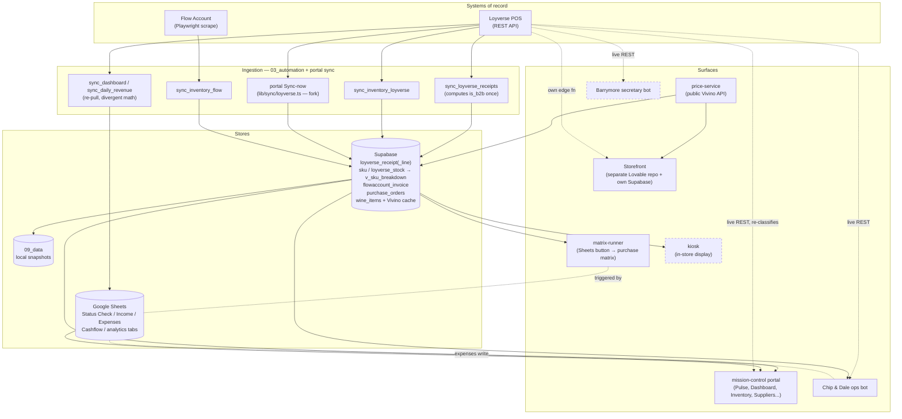

# Wine & Whiskey — System Architecture

This document describes the architecture of the Wine & Whiskey **Store OS** monorepo: how the pieces fit together, how data flows from the primary business systems to the surfaces people use, how it deploys, and what is live versus built-but-not-deployed.

> The store operates on **Asia/Bangkok (UTC+7)**. The two systems of record are **Loyverse** (POS — sales, inventory, suppliers/POs) and **Flow Account** (accounting/tax — B2B invoices). Everything else is derived from those two and should trace back to them.

---

## 1. Monorepo layout

The repo is a single Git repo (`github.com/rasputinpavel/wineandwhiskey`) organized by domain rather than by language. Folder rules are enforced in `CLAUDE.md`.

| Area | Purpose |
|------|---------|
| `.inbox/` | Incoming, unprocessed materials (files to triage). Not knowledge, not output. |
| `01_agents/` | Virtual employees — Telegram bots running on Railway. `bot/` (Chip & Dale, ops) and `barrymore/` (secretary). |
| `02_services/` | Web services on Railway. `mission-control` (core portal), `price-service`, `trendwatch`, `kiosk`. (`matrix-runner` retired 2026-06-05 — Wine Matrix is native in the portal.) |
| `03_automation/` | ~40 standalone `.tsx` sync/build scripts run via root `package.json` npm scripts, plus a shared `lib/`. |
| `04_brand/` | Design system, tokens, logo, product images, visual references. |
| `05_creative/` | Creative output: `social/`, `catalog/`, dated `output/` exports. |
| `06_knowledge/` | Store knowledge base (`wine/` concepts, regions, styles). |
| `07_contacts/` | Partners, team, salary/payroll breakouts. |
| `08_config/` | Store settings and thresholds (e.g. `po_exclude.json`). |
| `09_data/` | Local data store: inventory, sales, products, suppliers snapshots. |

Each `02_services/*` app and each `01_agents/*` bot is its **own npm package**; `03_automation` is a third package. **There is no shared internal package**, which is the root cause of the cross-cutting duplication noted in the audit (B2B classifier, Loyverse client, formatters are copy-pasted across these boundaries).

---

## 2. Primary systems & data stores

### Systems of record (upstream)
- **Loyverse (POS)** — REST API (`api.loyverse.com/v1.0`). Source of truth for receipts/sales, inventory on-hand, suppliers, and the purchase-order dashboard.
- **Flow Account (accounting / B2B)** — no public API; scraped via Playwright (`03_automation/lib/flow.ts`). Source of truth for B2B/tax invoices and AR.

### Stores (downstream caches & derived data)
- **Supabase** (single project, shared by all services). Schemas/tables of note:
  - `inventory.loyverse_receipt` (+ `_line`) — the canonical cached receipt mirror, with `is_b2b` and `cost_total` computed **once at ingest**.
  - `inventory.sku`, `inventory.loyverse_stock` → exposed via the `v_sku_breakdown` view (single on-hand path).
  - `inventory.flowaccount_invoice` — Flow mirror (AR / tax).
  - `public.purchase_orders` / `purchase_order_items` — scraped Loyverse PO dashboard; shared by portal **and** bots.
  - `public.wine_items` + Vivino cache tables — wine enrichment.
  - `inventory.fixed_cost`, `pulse_settings` — P&L inputs.
  - `public.receipts` / `receipt_items` — **dead second receipt cache** (write-only, no readers).
- **Google Sheets** — the legacy "Status Check W&W" dashboard, income/expenses, cashflow, and per-period analytics tabs. Bots write expenses here; several automation scripts read/write here. Being migrated into the native portal.
- **09_data/** — local file snapshots.

---

## 3. Components & how they connect

### 02_services/mission-control — the core portal (live)
Next.js App Router. Server-first: most pages are React Server Components reading Supabase directly through schema-scoped clients in `lib/supabase.ts` (inventory / sales / promo / public). Routes under `app/(portal)/m/`: dashboard, pulse, inventory, price, customers, sales, suppliers, wine-matrix, promo, reactivation, creative-library, product-images, brand-assets, design-system.

Key reads are well-anchored: **Pulse** and the native **Dashboard** both read the cached `inventory.loyverse_receipt` table (refunds signed −1, cancelled excluded, `is_b2b` precomputed); inventory on-hand reads the single `v_sku_breakdown` view. The **price parser registry** (`lib/price/parsers`) is the most extensible subsystem — one file + one registry entry per supplier.

Notable couplings/divergences: `lib/sync/loyverse.ts` (the portal's "Sync now" write path) is a hand-copied fork of the automation sync; `lib/customer_match.ts` and `lib/loyverse.ts` each carry their own copy of the B2B pattern list (drifted from canonical); the SKU-detail page re-derives B2B live from Loyverse REST instead of reading the cached column.

### 02_services/price-service — price list manager (live)
Next.js. Parses supplier price lists and serves **Vivino enrichment** to the external storefront via a key-gated public API (`app/api/public/vivino/lookup`, `STOREFRONT_API_KEY`). Per `CLAUDE.md` this is the storefront's designated Vivino source. Its `lib/parsers` + Vivino libs are duplicated byte-for-byte inside mission-control.

### 02_services/matrix-runner — RETIRED 2026-06-05
Was a tiny Express webhook for the Google-Sheets "Пересчитать матрицу" purchase-matrix button (a manual fork of `03_automation/build_purchase_matrix.ts`). The Google-Sheet purchase-matrix flow is no longer used; the portal's native **Wine Matrix** page is the interface now. Service removed from the repo and Railway.

### 02_services/kiosk — in-store sommelier display (built, NOT committed to git)
Read-only Next.js app reading `v_sku_breakdown` + `public.wine_items` with name-normalization joins. Has its own `railway.json`, `.gitignore`, `.env.example`. **0 files are tracked in git** — so it cannot deploy through the push-to-main pipeline until committed.

### 02_services/trendwatch — reels/creative tool (built, not deployed)
Tracked in git (58 files) with a `railway.json`, but not deployed (needs `TRENDWATCH_SECRET`/`PASSWORD`, `RUNWAY_API_TOKEN`, a Storage bucket). Registry status `building`; portal links to a Railway host that likely 404s. Does not touch Loyverse/Flow.

### 01_agents/bot — Chip & Dale, staff ops bot (live)
grammY + Anthropic agent loop on Railway. Tools hit Loyverse REST directly and the shared Supabase `purchase_orders` tables; writes expenses to Google Sheets; posts a cron morning briefing. Its `getSales` sums all `SALE` receipts with **no B2B/refund/cancel handling**, so its numbers differ from the dashboards. Contains a dead third Loyverse client (`src/loyverse.ts`).

### 01_agents/barrymore — secretary bot (built, not deployed)
grammY + Anthropic + Whisper + Google Calendar; persists tasks/chronicle/notes to its own Supabase tables. `src/store.ts` is a verbatim copy of the ops bot's `src/tools.ts` (already slightly drifted). Needs tokens + migrations applied + Railway deploy.

### 03_automation — sync/build scripts (live, run via npm)
Flat set of ~40 scripts wired to root `package.json` (`dashboard`, `matrix`, `b2b`, `accounting`, `harvest`, `receipts`, `inv:loyverse`, `inv:flow`, `inv:receipts`, `sync:all`, etc.). Shared `lib/`: `b2b.ts` (canonical B2B classifier), `b2b_overrides.ts`, `flow.ts` (Flow scraper), `sales_aggregate.ts` (the intended single aggregator — currently only one orphan consumer), `sku_match.ts`, `wine_detect.ts`. ~18 scripts are orphans not wired to npm. Each script reimplements its own Loyverse fetch / Google OAuth / Supabase client / dotenv.

### Storefront (separate repo — phuket-sip-reserve, live)
Customer-facing wine catalog + reservations, edited via Lovable, on its **own Lovable Cloud Supabase**. Reads Vivino enrichment from price-service's public API. Stock comes from its own Loyverse-sync edge function, not from this monorepo.

---

## 4. Data flow

**Reading the diagram:** Solid lines into Supabase are the disciplined cached path (ingest once → read many). Dotted "live REST" lines are the components that bypass the cache and re-pull/re-classify from Loyverse directly (bots, SKU-detail page) — the main place numbers can disagree. The Google-Sheets path (`sync_dashboard`) re-derives the same metrics a second way and currently overstates revenue because it does not net refunds.

---

## 5. Deployment model

- **Platform:** Railway. **All services and bots deploy automatically on push to `main`** (per `CLAUDE.md`).
- **Per-service config:** every `02_services/*` has a `railway.json` (NIXPACKS) with an `/api/health` healthcheck; each `01_agents/*` bot has a `railway.toml`. Each Railway service sets its **Root Directory** to the relevant subfolder.
- **Automation scripts** are not a deployed service — they run via root `npm run <name>` (locally or scheduled), pulling/pushing Supabase, Loyverse, Flow, and Google Sheets.
- **Storefront** deploys independently from its own Lovable repo and Supabase.
- **Secrets:** never committed. `.env.local` locally, Railway environment variables in production; see `config/secrets.example.env`.

> Gap: because the kiosk service is **not tracked in git**, the "push to main → deploy" contract cannot apply to it until it is committed.

---

## 6. Live vs built-not-deployed

| Component | Type | Status |
|-----------|------|--------|
| mission-control portal | Web service | **Live** |
| price-service | Web service | **Live** |
| ~~matrix-runner~~ | Web service (webhook) | **RETIRED 2026-06-05** — Google-Sheet purchase matrix dropped; Wine Matrix is native in the portal now |
| 03_automation scripts | CLI / scheduled | **Live** |
| Chip & Dale ops bot | Telegram bot | **Live** |
| Storefront (separate repo) | Web app | **Live** |
| Google-Sheet dashboards / analytics | Sheets | **Live** (legacy, being migrated) |
| kiosk | Web service | **Built, NOT in git** → cannot deploy yet |
| trendwatch | Web service | **Built, not deployed** (missing env + Storage) |
| Barrymore secretary bot | Telegram bot | **Built, not deployed** (needs tokens + migrations) |

Portal registry note: many `m/*` portal tiles carry `status: 'building'` (pulse, inventory, customers, suppliers, wine-matrix, dashboard, reactivation, promo) even though the portal itself is deployed — these are feature-maturity flags inside a live app, not separate deployments.

---

## 7. Architectural principles & where they hold

1. **Single source of truth (Loyverse / Flow).** Held on the cached read path (Pulse, Dashboard, inventory, accounting all trace back through Supabase mirrors). Broken on: the Google-Sheet dashboard math (no refund netting), the bots' raw sales sum, the SKU-detail live re-classification, and the matrix-runner fork.
2. **Cross-cutting rules shared, not duplicated.** Intended (`lib/b2b.ts`, `sales_aggregate.ts`, `sku_match.ts`, `flow.ts`) but under-adopted: the B2B classifier exists in 4 copies (some drifted), the Loyverse client in ~20, the whole price/Vivino subsystem in 2, and the inventory sync in 2.
3. **Easily scalable.** The price parser registry and schema-scoped Supabase clients scale cleanly; the copy-paste across package boundaries and name-string joins (PO↔supplier, SKU↔wine_items) are the parts that will hurt as services/SKUs/channels grow. The highest-leverage fix is to stand up **one shared internal workspace package** and route every consumer through it.
