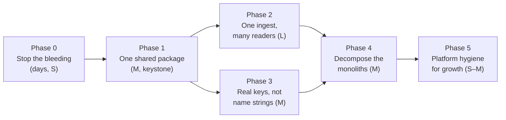

# Wine & Whiskey — Architecture Audit

**Date:** June 2026
**Scope:** Full monorepo — `02_services/*` (mission-control, price-service, trendwatch, matrix-runner, kiosk), `01_agents/*` (Chip & Dale ops bot, Barrymore), `03_automation`, shared `lib/`, the Supabase data model, `08_config`, `09_data`.
**Areas audited:** 7 (mission-control · 03_automation · source-of-truth · cross-cutting patterns · agents · secondary services · data model).
**Lens:** The owner's three principles — (1) source of truth must anchor to Loyverse (POS) and Flow Account (accounting); (2) cross-cutting rules must be shared, not duplicated; (3) architecture must scale.
**Mode:** Read-only. No files were modified.

---

## Executive Summary

The architecture is fundamentally sound where it matters most: Loyverse (POS) and Flow Account (accounting) are genuinely treated as the upstream source of truth, and the mission-control portal's read paths are well-disciplined — Pulse and the native Dashboard both read a single cached table (`inventory.loyverse_receipt`) with a pre-computed `is_b2b` column, inventory on-hand reads one DB view (`v_sku_breakdown`), and the price-parser registry is a model of extensibility. The team has also correctly identified the right abstractions (`lib/b2b.ts` `classifyReceipt`, `lib/sales_aggregate.ts`, `lib/sku_match.ts`, `lib/flow.ts`).

The problem is not the design intent — it is that the abstractions are **unenforced and under-adopted**, and the monorepo has **no shared internal package**, so every cross-cutting rule must be copy-pasted across the `03_automation` / mission-control / agents / matrix-runner boundaries to be reused. That copy-paste has already silently drifted in production-facing places.

The result is multiple **concrete** source-of-truth violations rather than hypothetical ones:

- The B2B customer list in `customer_match.ts` has diverged from canonical (adds olabar/pinz/titov/sukmesum/volna pool, drops pinzerai/secret spot/shaman phuket).
- The live matrix-runner "Recalculate matrix" button produces B2B-contaminated velocity because its forked `matrix.ts` never got the B2C-only fix the CLI got (zero `classifyReceipt` usage).
- The legacy Google-Sheet Dashboard overstates revenue/GP because `sync_dashboard.ts` has no refund/cancel handling.
- ~20 scripts each reimplement the Loyverse fetch with only one carrying the recent transient-error retry.
- The declared single aggregator `sales_aggregate.ts` has exactly one consumer, itself an orphan.

None of these invent a separate database, but they each invent a separate **answer** to the same question. The highest-leverage move is structural: stand up one shared workspace package, make the shared modules the only entry points, and route every analytics/agent/runner consumer through them. Once that exists, most findings collapse into single-line fixes.

---

## Top Priorities

| # | Title | Impact | Effort | Why it matters |
|---|-------|:------:|:------:|----------------|
| 1 | **Stand up one shared internal package** (workspace / path-alias) as the home for cross-cutting logic | High | M | Root cause of nearly every duplication and drift finding. `03_automation`, each `02_services/*`, and `01_agents/*` are separate npm packages with no shared package, so B2B classification, the Loyverse client, money/tz formatters, and wine vocab can only be reused by copy-paste. Has already caused production drift. Every subsequent fix becomes a one-line change in one place. |
| 2 | **Unify B2B classification** on one `classifyReceipt` + `B2B_PATTERNS`; delete divergent copies | High | M | The same business rule has 4 definitions; 3 no longer agree. `customer_match.ts` has drifted from canonical, so the FA→LV matcher classifies different clients as B2B than the nightly sync, dashboard, and accounting. `identify_bestsellers.ts` omits the bank-transfer condition entirely. |
| 3 | **Eliminate the matrix-runner fork** so the live purchase matrix applies B2C-only velocity | High | S | `matrix-runner/matrix.ts` has zero B2B classification while the CLI now excludes B2B. The live "Пересчитать матрицу" button produces B2B-contaminated reorder numbers — a concrete divergence in the purchase plan, the owner's primary metric (turnover). |
| 4 | **Fix or retire the legacy Google-Sheet Dashboard** (`sync_dashboard.ts`) so it nets refunds / excludes cancelled | High | S | No refund/cancel handling and Loyverse ignores `receipt_type=SALE`, so REFUND rows are counted as positive sales. The "Status Check W&W" sheet overstates revenue/GP/checks vs the native Dashboard. Same KPI, two answers, one wrong. |
| 5 | **Extract one Loyverse client (with retry)** and migrate analytics scripts onto `sales_aggregate.ts` | High | L | ~20 scripts plus both bots, matrix-runner, and two MC modules each reimplement `loyverseFetch` + pagination; only `sync_loyverse_receipts.ts` has the transient-empty-body retry (commit a79cfb8). `sales_aggregate.ts` was built to be the single aggregator but has exactly one (orphan) consumer. |
| 6 | **Commit the kiosk service to git** | Medium | S | `git ls-files` reports **0 tracked files** under `02_services/kiosk`; not gitignored — simply never added. CLAUDE.md states all services deploy on push to main, so it can never deploy, and lives outside version control, review, and backup. |
| 7 | **De-duplicate the price/Vivino subsystem**; pick one owner of the public Vivino API | Medium | M | 17 parsers in MC are byte-identical to price-service; Vivino libs identical except import paths; BOTH services expose `app/api/public/vivino/{lookup,by-url}` against the same Supabase tables. CLAUDE.md designates price-service as the storefront's source. |
| 8 | **Extract Pulse P&L into `lib/pulse.ts`**; share fixed-cost/revenue model with `dashboard.ts` | Medium | M | 1270-line `pulse/page.tsx` bundles fetchers, the entire cash-basis P&L, and rendering. The most business-critical numbers (owner P&L) are untestable and live in a page component; `dashboard.ts` has overlapping-but-different logic that can drift. |
| 9 | **Resolve `purchase_orders` to a supplier FK** instead of normalized-name matching; surface unmatched POs | Medium | M | PO→supplier joins are by `name.trim().toLowerCase()`. On a miss the lookup silently defaults `payment_terms_days=0`/`type='regular'`, so an unmatched consignment supplier is double-counted and a regular supplier's payment date collapses to order_date — quietly skewing the cash-basis P&L. |
| 10 | **Serve SKU-detail B2C sales and the bots' revenue from the persisted `is_b2b` column** | Medium | M | `lib/loyverse.ts` re-scans Loyverse REST (≤30 pages/SKU, lifetime customer-name cache) and re-derives B2B for the SKU page. Both bots' `getSales` sum all SALE receipts with NO B2B/refund/cancel handling — the team-wide morning briefing reports a different revenue than the dashboard. |
| 11 | **Centralize remaining duplicated helpers**: PostgREST pagination, money/tz/date formatters, billing-cycle, Loyverse sync | Medium | M | 1000-row pagination copy-pasted across 5 pages (caps 100000 vs 200000); THB inlined ~35× with mixed locales; Bangkok-tz math re-expressed multiple ways; supplier billing-cycle `periodRange` copy-pasted; `lib/sync/loyverse.ts` is a hand-fork of the CLI sync. |
| 12 | **Triage automation orphans, dead caches, hardcoded constants** | Low | M | 18/40 scripts unwired from package.json (incl. completed one-shot `_fix_po_totals.ts`); `public.receipts` is a write-only dead second cache; `bot/src/loyverse.ts` is a dead third client; financial constants hardcoded in source. |

**Effort:** S = small (hours–day) · M = medium (days) · L = large (1–2 weeks+)

---

## Findings by Area

Severity legend: 🔴 High · 🟡 Medium · 🟢 Low

### Area 1 — `02_services/mission-control` (core Next.js portal)

Server-first App-Router portal organized around a clean section/item registry (`lib/registry.ts`); 51/56 page files are React Server Components reading Supabase directly via four schema-scoped clients in `lib/supabase.ts`. Data anchoring is mostly correct: pages read the Loyverse/Flow mirror tables rather than inventing numbers, and B2B on the mirror is the materialized `is_b2b` column. The price-parser subsystem is the architectural high point. Health problems are localized.

**Strengths**
- Server-first RSC: 51/56 tsx are server components; only 5 `'use client'`. No service-role key leakage; middleware-gated.
- `lib/supabase.ts` centralizes one schema-scoped client per Postgres schema (`sbInventory`/`sbSales`/`sbPromo`/`sbPublic`) with shared row types.
- Price parser subsystem (`lib/price/parsers/index.ts`) is a true registry: each supplier owns `detect()`/`run()`, boilerplate in `_shared.ts`, generic `detect→pdftoppm→text→vision` fallback in `extract.ts`.
- Pages read Loyverse/Flow mirror tables (`loyverse_receipt`, `flowaccount_invoice`, `sku`, `purchase_orders`) rather than recomputing.
- `lib/dashboard.ts`/`lib/kpi.ts` isolate pure BKK-time/period/aggregation logic; `dashboard.ts` documents that its definitions mirror `sync_dashboard.ts`.

| Sev | Title | Detail | Recommendation | Files |
|:---:|-------|--------|----------------|-------|
| 🔴 | **`B2B_PATTERNS` duplicated and silently diverged** | Canonical classifier is `03_automation/lib/b2b.ts`. MC cannot import it, so it keeps two hand-copies: `lib/loyverse.ts:19-25` and `lib/customer_match.ts:24-29` (the latter labels itself "продубликат … синхронизировать вручную"). The arrays have ALREADY diverged — `customer_match.ts` adds olabar/phuket kachatip/pinz/sukmesum/titov/volna pool and is missing pinzerai/secret spot/shaman phuket. | Make `b2b.ts` the single published source; delete the two MC copies. At minimum add a CI deep-equal check. | `lib/loyverse.ts`, `lib/customer_match.ts`, `03_automation/lib/b2b.ts` |
| 🔴 | **`pulse/page.tsx` is a 1270-line monolith** | Largest file in the portal. Inlines its own paginated fetchers, the entire cash-basis P&L (supplier pay-date derivation, consignment settlement bucketing with hardcoded `HARVEST_PO_CUTOFF`, fixed-cost buffer, MTD projection) AND all rendering. Untestable; the owner P&L lives in a page component. Overlaps `dashboard.ts` logic. | Extract a pure `lib/pulse.ts` mirroring `lib/dashboard.ts`; reuse one fixed-cost + revenue definition across both screens. | `app/(portal)/m/pulse/page.tsx`, `lib/dashboard.ts` |
| 🟡 | **PostgREST 1000-row pagination copy-pasted across 5 pages** | The `for (from=0; from<100000; from+=PAGE) …range(...)` workaround is re-implemented in pulse (×2), dashboard, and both supplier report pages, with inconsistent caps (100000 vs 200000). | Add one `fetchAllRows(query)` helper in `lib/supabase.ts`; centralize the cap constant. | pulse, dashboard, suppliers `[id]/report` + `report/sales` |
| 🟡 | **PO→supplier join by name string, not FK** | `purchase_orders.supplier` is free text joined by `name.trim().toLowerCase()` in pulse/suppliers/purchase-orders pages. On a miss it silently defaults `payment_terms_days=0`/`type='regular'` — unmatched consignment supplier isn't excluded (double-count) and a regular supplier's payment date collapses to order_date. | Resolve POs to `supplier_id` (FK or resolution table); surface unmatched POs in the UI. | pulse, suppliers, suppliers/purchase-orders |
| 🟡 | **`lib/sync/loyverse.ts` is a hand-fork of the CLI sync** | Header: "same logic as `/03_automation/sync_inventory_loyverse.ts`". Re-implements items/categories/inventory pagination + variant→sku upsert + sync_log (176 vs 229 lines). This is the portal's only WRITE path to the mirror, so Sync-now and cron can write different stock. | Factor the products/stock sync into one shared module imported by both. | `lib/sync/loyverse.ts`, `03_automation/sync_inventory_loyverse.ts` |
| 🟢 | **Live Loyverse REST uses process-lifetime caches** | `lib/loyverse.ts` (SKU drill-down) caches the customer id→name map for the life of the process and sets `revalidate:300`. New B2B customers are misclassified until restart; scans ≤30 pages/SKU in memory. | Read the pre-classified `inventory.loyverse_receipt` mirror; if live REST stays, bound the cache with a TTL. | `lib/loyverse.ts`, inventory `sku/[...code]/page.tsx` |
| 🟢 | **Plan/handover constants hardcoded** | `PLAN_START_YM`/`PLAN_MULT`/`PLAN_YEAR` in `dashboard.ts`; `HARVEST_PO_CUTOFF`/`HARVEST_START_YM` + 15% buffer default in pulse. Repo already has `08_config` and a `pulse_settings` table. | Move into `08_config`/settings so rolling into 2027 is a config edit. | `lib/dashboard.ts`, pulse |

### Area 2 — `03_automation` (sync/build scripts + shared `lib/`)

A flat collection of ~40 standalone tsx scripts run via root `package.json`, plus a small shared `lib/` (b2b, b2b_overrides, flow, sales_aggregate, sku_match, wine_detect). The good libs exist but adoption is shallow.

**Strengths**
- `lib/sku_match.ts` — clean single matcher (token-set Jaccard + containment + Levenshtein-1, volume-aware), shared by `sync_inventory_flow.ts` and `rematch_unmapped.ts`.
- `lib/sales_aggregate.ts` — correctly encodes the net-sales convention (SALE+REFUND, subtract refunds, skip cancelled) AND uses `classifyReceipt`.
- `lib/flow.ts` — centralizes all FlowAccount Playwright scraping behind typed helpers; accounting truth is read, not invented.
- `lib/wine_detect.ts` — single grape/country/region detector reused by matrix/attrs/breakdown.
- `lib/b2b.ts` — documents the B2B pattern list with provenance.

| Sev | Title | Detail | Recommendation | Files |
|:---:|-------|--------|----------------|-------|
| 🔴 | **`classifyReceipt()` bypassed; B2B rule re-assembled inline in ~6 scripts** | Most scripts import only the primitives and re-write the rule by hand (`monthly_b2c_margin:252`, `sync_dashboard:156`, `sync_b2b:201`, `sync_daily_revenue:159`, `sync_loyverse_receipts:167`). `identify_bestsellers:296` is worse — uses ONLY `isB2BCustomerName`, OMITTING the bank-transfer condition. | Make `classifyReceipt()` the only public entry; stop exporting raw primitives. Fix `identify_bestsellers` to include bank-transfer. | `lib/b2b.ts`, monthly_b2c_margin, sync_dashboard, sync_b2b, sync_daily_revenue, sync_loyverse_receipts, identify_bestsellers |
| 🔴 | **Two divergent revenue conventions** | `sales_aggregate.ts` encodes the correct rule; the high-traffic inline scripts query `receipt_type=SALE` with ZERO refund/cancel handling (grep for refund/cancel returns nothing in `sync_dashboard.ts`/`monthly_b2c_margin.ts`). They overstate net sales vs Loyverse truth. | Route every Loyverse-sales script through `aggregateSales()`. | sales_aggregate, sync_dashboard, wine_matrix, monthly_b2c_margin, sync_daily_revenue, identify_bestsellers |
| 🔴 | **The declared single aggregator has only one orphan consumer** | `sales_aggregate.ts` header says it is the only place to fetch+classify+aggregate. grep shows only `channels_diagnostic.ts` imports it — itself an orphan not wired to package.json. matrix, monthly margin, segmentation, b2b_reserve all still roll their own. | Migrate the listed consumers; delete bespoke loops. | sales_aggregate, channels_diagnostic, build_purchase_matrix, monthly_b2c_margin, inventory_segmentation, b2b_reserve, category_margin_diagnostic |
| 🔴 | **No shared data-access/config layer** | No `lib/loyverse.ts`/`lib/sheets.ts`/`lib/supabase.ts`/`lib/env.ts`. ~20 scripts each define paginated Loyverse fetch, ~22 re-implement Google OAuth refresh, ~15 call `createClient()`, every script does its own dotenv. MC already has clients that automation doesn't reuse. | Extract shared loyverse/sheets/supabase/env libs; ideally share the Loyverse client with MC. | sync_dashboard, wine_matrix, sync_daily_revenue, sync_b2b, sync_inventory_loyverse, sync_loyverse_receipts, sync_accounting |
| 🟡 | **B2B pattern list hand-duplicated across 3 files / 2 services** | Source `b2b.ts`, copied in `mc/lib/customer_match.ts:24` (with manual-sync comment) and `mc/lib/loyverse.ts:19`. Lists already differ in length. | Publish one shared module imported by both. | b2b.ts, customer_match.ts, loyverse.ts |
| 🟡 | **Parallel/overlapping sync scripts, no clear ownership** | Three receipt syncs (`sync_receipts` → public tables, `sync_loyverse_receipts` → inventory schema, `sync_daily_revenue` → Sheet) each re-pull + re-derive B2B. `generate_dashboard.ts` (orphan) overlaps `sync_dashboard.ts`. | One canonical receipts ingestion; downstream builders read from it. Archive `generate_dashboard.ts`. | sync_receipts, sync_loyverse_receipts, sync_daily_revenue, generate_dashboard, sync_dashboard |
| 🟢 | **18 orphan scripts not wired to package.json** | Includes `_fix_po_totals.ts` (explicit completed one-shot — deletion candidate), `b2b_anonymous_audit`, `category_margin_diagnostic`, `channels_diagnostic`, `generate_dashboard`, `monthly_b2c_margin`, `rematch_unmapped`. Violates the owner's tidiness rule. | Delete completed one-shots; move diagnostics to a labeled dir; wire the rest into package.json. | _fix_po_totals, b2b_anonymous_audit, category_margin_diagnostic, channels_diagnostic, monthly_b2c_margin, rematch_unmapped |
| 🟢 | **Largest scripts are monolithic** | `sync_accounting` (~64KB), `sync_dashboard` (~67KB), `build_purchase_matrix` (~63KB), `wine_breakdown` (~75KB), `wine_matrix` (~40KB), `monthly_b2c_margin` (~35KB) each combine fetch + classify + business rules + rendering inline — the reason refund/B2B logic got copy-pasted. | Split into data-fetch → aggregate → render layers. | sync_dashboard, sync_accounting, build_purchase_matrix, wine_breakdown, monthly_b2c_margin |

### Area 3 — Source of Truth & Data Integrity (Loyverse + Flow ingestion)

The portal is well-disciplined; the problems are upstream in `03_automation` and a few portal helpers.

| Sev | Title | Detail | Recommendation | Files |
|:---:|-------|--------|----------------|-------|
| 🔴 | **B2B rule duplicated in 4 places (only 1 is real)** | Canonical `b2b.ts`; copied into `mc/lib/loyverse.ts`, `mc/lib/customer_match.ts` (manual-sync comment), referenced by reactivation. Lists drift; SKU page "B2C sales" and Customers matching can disagree with Pulse/Dashboard/accounting. | One shared module + CI deep-equal assertion. | b2b.ts, loyverse.ts, customer_match.ts, reactivation/excluded.ts |
| 🔴 | **Dashboard metrics computed two ways; legacy Sheet doesn't subtract refunds** | Native portal signs REFUND −1. Legacy `sync_dashboard.ts` queries `receipt_type=SALE` but Loyverse ignores the param (per `sync_accounting.ts:261` comment), so the response contains REFUND rows it counts as positive sales. Sheet overstates revenue/GP/checks. | Retire the Sheet (intended migration direction) or fix to sign refunds −1 / read the cached table. | sync_dashboard.ts, lib/dashboard.ts, dashboard/page.tsx |
| 🔴 | **No single Loyverse client — ~20 ad-hoc fetchers** | ~15 automation scripts + both bots + matrix-runner + two MC modules each define their own `loyverseFetch`. Only `sync_loyverse_receipts.ts` has the transient-error retry (commit a79cfb8); the other ~15 hard-fail on the same error. | One client with retry; migrate the 7 intended aggregator consumers; prefer reading the cached table. | sales_aggregate, monthly_b2c_margin, identify_bestsellers, category_margin_diagnostic, build_purchase_matrix, wine_matrix, matrix-runner/matrix.ts |
| 🟡 | **Two parallel receipt caches; `public.receipts` is write-only dead data** | `sync_receipts.ts` → `public.receipts`/`receipt_items`; `sync_loyverse_receipts.ts` → `inventory.loyverse_receipt`. Nothing reads `public.receipts` except the writer (verified); it lacks `is_b2b`/`cost_total`, so any future reader computes revenue differently. | Retire `sync_receipts.ts` + the `public.receipts` tables. | sync_receipts, sync_loyverse_receipts, reactivation/data.ts |
| 🟡 | **Products+stock sync exists as two copy-paste copies** | `mc/lib/sync/loyverse.ts` vs `03_automation/sync_inventory_loyverse.ts`. The automation copy carries a pagination-bug comment (unpaginated sku map dropped ~2/3 of SKUs). A fix in one and not the other → web Sync-now and cron write different stock. | One shared module imported by both. | sync/loyverse.ts, sync_inventory_loyverse.ts |
| 🟡 | **Live re-classification on SKU detail page diverges from cached truth** | `mc/lib/loyverse.ts` hits Loyverse live (5-min revalidate), re-derives B2B with its own (drifted) pattern copy, scans ≤30 pages/SKU. A SKU's "B2C 90d" can disagree with Dashboard/Pulse for the same period. | Serve from `loyverse_receipt_line` joined to `loyverse_receipt` (is_b2b precomputed). | loyverse.ts, sku/[...code]/page.tsx |
| 🟢 | **Cached receipts can go stale** | In `registry.ts` the receipts source is `runnable:'manual'` (default 30-day window) while products/stock and Flow run on an 8h cron. Pulse/Dashboard read only the cache, so if nobody runs `inv:receipts` headline numbers silently lag. | Put `loyverse_receipts` on the 8h cron; show a staleness banner. | registry.ts, pulse/page.tsx, sync_loyverse_receipts.ts |

### Area 4 — Cross-cutting patterns (focus: B2B classification + shared helpers)

The B2B rule has one well-designed canonical module reused across ~13 automation scripts via import, but MC re-implements it twice; beyond B2B several other concerns are copy-pasted.

| Sev | Title | Detail | Recommendation | Files |
|:---:|-------|--------|----------------|-------|
| 🔴 | **B2B rule re-implemented 3× across packages; lists already diverged** | `customer_match.ts` ADDS olabar/phuket kachatip/pinz/q squad/sukmesum/titov/volna pool and is MISSING pinzerai/secret spot/shaman phuket vs canonical. The FA→LV automatcher matches a different B2B set than the nightly sync. The memory note "classifyReceipt used everywhere" is false inside MC. | One shared package exporting the constants + `classifyReceipt`; delete the copies; add an equality test. | b2b.ts, loyverse.ts, customer_match.ts, sync_loyverse_receipts.ts |
| 🟡 | **SKU detail re-derives B2B live, bypassing the persisted `is_b2b`** | Second parallel classification path; will disagree as patterns drift (they already have). Re-paginates Loyverse per page view. | Read line-level B2C from persisted tables filtered `is_b2b=false`. | loyverse.ts, dashboard.ts, sku/[...code]/page.tsx |
| 🟡 | **Supplier billing-cycle `periodRange` copy-pasted across two report pages** | `periodRange(period, startDay)` defined independently in `report/page.tsx:24` and `report/sales/page.tsx:10` (logically identical). This is the owner-flagged sensitive 5th-to-5th consignment-settlement math, duplicated in two files that must move together. A third `periodRange` in `kpi.ts` (different signature) adds name confusion. | Extract `lib/billing-cycle.ts`; namespace the `kpi.ts` one. | report/page.tsx, report/sales/page.tsx, kpi.ts |
| 🟡 | **THB/money inlined ~35× with inconsistent locale/rounding** | `lib/fmt.ts` has date helpers but NO money helper. Mix of `en-US`/`ru-RU`, `Math.round` vs `maximumFractionDigits:0` vs `:2`, hand-typed `฿`. Same amount renders differently across screens. | Add `fmtTHB`/`fmtMoney`/`fmtInt`/`fmtPct` to `lib/fmt.ts`; replace inline calls. | fmt.ts, report/sales/page.tsx |
| 🟢 | **Bangkok-tz math expressed in several idioms** | `kpi.ts` `BKK_OFFSET_MIN`; `sales_aggregate.ts` `+07:00` string literals; `sync_harvest_sales.ts` `Date.now()+7*3_600_000`. No shared "start/end of Bangkok day" utility. | One `bangkokDayRange(ymd)`/`bangkokToday()` utility. | kpi.ts, sales_aggregate.ts, sync_harvest_sales.ts |
| 🟢 | **Grape detection in two unrelated implementations** | `wine_detect.ts` (matrix) vs `mc/lib/price/classify.ts` (`WHITE_RX`/`RED_RX` with the same grape vocab). Different concerns but overlapping vocab that can drift. | Move grape vocab/`detectGrape` into the shared package. | wine_detect.ts, price/classify.ts |

### Area 5 — `01_agents` (Chip & Dale ops bot + Barrymore secretary bot)

Two grammY + Anthropic Telegram bots run with tsx on Railway. The ops bot is deployed; Barrymore is written but not deployed. Code is clean per-file but coupled by copy-paste, and both read sales with a simpler "sales" definition than the rest of the repo.

**Strengths**
- Both anchor live reads to the Loyverse REST API (real-time, traceable), not a stale local cache.
- PO tools read the shared Supabase `purchase_orders`/`purchase_order_items` tables (data model IS shared here).
- Resilient UX: HTML-with-plain-fallback send, expense state re-parsed from message text (survives redeploy), per-chat TTL, 15s `AbortController`.
- No secrets committed; tokens read only from `process.env`.

| Sev | Title | Detail | Recommendation | Files |
|:---:|-------|--------|----------------|-------|
| 🔴 | **Barrymore's `store.ts` is a verbatim copy of the ops bot's `tools.ts`** | Header literally says "Копия из bot/src/tools.ts". All 7 store functions + `loyverseFetch` + category classifiers duplicated. Already drifted: barrymore dropped duplicated `armagnac`/`lagoda` entries and omits the GP divide-by-zero guard the bot has. | Extract one shared store module; at minimum generate the copy from a script. | barrymore/src/store.ts, bot/src/tools.ts |
| 🔴 | **Bot sales definition diverges from source of truth** | Both `getSales` sum every `receipt_type=SALE` (`totalRevenue += r.total_money`) with NO B2B exclusion, NO refund netting, NO cancel handling — including the daily morning briefing the whole team sees. `classifyReceipt` not reused. | Consume the same B2B/refund classification, or explicitly label the bot number as "gross POS total incl B2B & refunds". | bot/src/tools.ts, barrymore/src/store.ts, mc/lib/loyverse.ts, b2b.ts |
| 🟡 | **Bottle-classification logic re-invented in the bots** | `getInventorySummary` classifies wine/spirits/beer/other via hardcoded category Sets + keyword/volume regex — a parallel implementation of `wine_detect.ts`/wine-matrix. "Всего бутылок" can disagree with the inventory page. | Centralize the category map + heuristic into one shared module. | bot/src/tools.ts, barrymore/src/store.ts, wine_detect.ts |
| 🟡 | **Google Sheet ID + tab schema hardcoded, duplicating ~10 automation scripts** | Spreadsheet ID hardcoded in `bot/src/sheets.ts`/`expenses.ts` and again across ~10 automation scripts; column layouts hardcoded. A planned migration of income/expenses to the portal breaks each independently. Note the bot CAN write `category='Кредиторка'` rows into Expenses (a different tab than the manually-maintained Кредиторка sheet) — confirm against the "Кредиторка ведётся вручную" rule. | Move sheet ID + tab/column mapping into shared config (`08_config`/env). | bot/src/sheets.ts, bot/src/expenses.ts, sync_dashboard.ts, read_income.ts |
| 🟡 | **Dead, divergent second Loyverse client in the bot** | `bot/src/loyverse.ts` (its own `loyverseFetch`, types, 5-min cache) is never imported; live code uses `tools.ts`. Third copy of the access pattern; the only one with a cache — a drift/maintenance trap. | Delete it (per the "no strays" rule) or fold the cache into the shared module. | bot/src/loyverse.ts |
| 🟢 | **Each tool call re-fetches the full catalog with no caching** | `getInventory`/`getInventorySummary`/`getLowStock`/`getSupplier` each pull `/items`+`/categories`+`/inventory` (+`/suppliers`) per invocation, fully paginated; the briefing fires several in parallel. Cost grows with SKU count. | Short-TTL in-memory cache in the shared Loyverse module. | bot/src/tools.ts, barrymore/src/store.ts |
| 🟢 | **Per-bot duplicated infra** | Near-identical `railway.toml`/`package.json`; Bangkok-time + HTML-fallback helpers re-implemented across `index.ts`/`expenses.ts`/`briefing.ts` (bot) and barrymore. Scaffolding multiplies per new bot. | A shared `01_agents/common` layer (tz, HTML send, agent loop, session store). | bot/src/index.ts, barrymore/src/index.ts, bot/src/briefing.ts |
| 🟢 | **Barrymore deployment incomplete; no own `.gitignore`** | Needs tokens + migrations 001/002. Barrymore has no local `.gitignore` (safe only via root ignore); both bots load dotenv from `../.env.local` but `bot/` also has an unread `bot/.env.local` — confusing dual-location env. | Document env + migration prerequisites; add a per-bot `.gitignore`; consolidate `.env.local`. | barrymore/src/index.ts, barrymore/migrations/001_init.sql, bot/.env.local |

### Area 6 — Secondary services (price-service, trendwatch, matrix-runner, kiosk)

All four point at the same Supabase project and read Loyverse-backed inventory views — none invent their own truth — but duplication and fork-drift threaten correctness.

**Strengths**
- price-service public Vivino lookup is key-gated (`STOREFRONT_API_KEY` via `x-api-key`) and is the documented single integration point for the storefront.
- kiosk is strictly read-only with a documented data contract (`v_sku_breakdown` + `wine_items`), 60s cache, graceful degradation.
- matrix-runner: lazy Supabase client, serializes concurrent runs, captures stdout back to Apps Script.
- Uniform deploy: every service has `railway.json` (NIXPACKS) + `/api/health`.

| Sev | Title | Detail | Recommendation | Files |
|:---:|-------|--------|----------------|-------|
| 🔴 | **matrix-runner/matrix.ts is a stale fork — missing B2B exclusion** | Hand-copy of `build_purchase_matrix.ts` (README: "синхронизируй обе копии"). The original was rewritten 2026-05-16 to exclude B2B (B2C-only velocity via `classifyReceipt`); the runner copy (last commit 2026-05-03) still aggregates ALL receipts with zero B2B classification. The live "Пересчитать матрицу" button produces B2B-contaminated reorder numbers. | Eliminate the fork (import shared logic) or, immediately, re-copy the current `matrix.ts`. | matrix-runner/matrix.ts, matrix-runner/wine_detect.ts, build_purchase_matrix.ts, lib/b2b.ts |
| 🔴 | **Entire price/Vivino subsystem duplicated price-service ↔ MC** | All 17 parsers byte-identical; classify/claude/extract/file-types/pdf-render/pdf/types-display identical; 6 Vivino files identical except import path. BOTH apps expose `app/api/public/vivino/{lookup,by-url}` against the same Supabase project + cache tables. | Pick one owner (price-service per CLAUDE.md); drop MC's duplicate public routes; share the lib. | price-service/lib/parsers, mc/lib/price/parsers, both vivino dirs, both public/vivino/lookup routes |
| 🔴 | **kiosk not committed to git** | `git ls-files 02_services/kiosk` returns 0 (verified); not gitignored — never added. Can't deploy via push-to-main; outside version control/backup/review. | `git add` + commit (verify `.env.local` excluded — it has its own `.gitignore`/`.env.example`); confirm Railway Root Directory. | 02_services/kiosk/, kiosk/.gitignore, kiosk/README.md |
| 🟡 | **Name-based inventory↔wine_items join reimplemented in kiosk and MC** | `kiosk/lib/wines.ts` normalizes SKU names to join `v_sku_breakdown` to `wine_items`; its comment says "same approach as wine-matrix/queries.ts". Fragile bridge in two hand copies. | Add a persistent SKU→wine_items mapping/view; share `normalizeName`. | kiosk/lib/wines.ts, mc/lib/wine-matrix/queries.ts |
| 🟡 | **matrix-runner synchronous webhook is brittle as catalog grows** | Matrix takes ~3–4 min; Apps Script `UrlFetchApp` caps at 6 min; `runMatrix()` runs synchronously inside POST with an in-process boolean lock. Crosses the ceiling as data grows; lock breaks on >1 replica. | Async pattern: 202 + job_id + poll `/status`, persist job state in Supabase. | matrix-runner/server.ts, matrix-runner/README.md |
| 🟢 | **trendwatch built but undeployed; registry links a likely-404 host** | `registry.ts` marks it `status:'building'` and embeds `https://trendwatch-production.up.railway.app` while it isn't deployed (needs secrets + Storage bucket). No source-of-truth concern. | Deploy and flip status, or gate the tile and stop linking the dead host. | registry.ts, 02_services/trendwatch/ |

### Area 7 — Data Model (Supabase schema, migrations, file stores)

The Supabase project is organized into custom schemas (`inventory`, `sales`, `promo`, plus ad-hoc `public`). The cached `inventory.loyverse_receipt` mirror (with `is_b2b` precomputed at ingest) and the `v_sku_breakdown` view are well-designed read paths. The surrounding *process*, however, is the weak point: no migration-tracking table, no Supabase CLI config, and no generated TypeScript types — both schema and types are hand-maintained and applied by manual SQL-editor paste. See `docs/DATA_MODEL.md` for the full table/view catalog.

**Strengths**
- Schema-scoped separation (`inventory` / `sales` / `promo`) keeps the POS mirror, derived sales, and marketing data cleanly partitioned.
- `is_b2b` is materialized at ingest on the receipt mirror, so portal reads never re-classify.
- `v_sku_breakdown` gives every consumer (portal, kiosk, matrix) one on-hand definition.

| Sev | Title | Detail | Recommendation | Files |
|:---:|-------|--------|----------------|-------|
| 🔴 | **`purchase_orders` → supplier join by name string, not FK** | A name miss silently defaults `payment_terms_days=0`/`type='regular'`, so an unmatched consignment supplier isn't excluded and cash is double-counted in Pulse with no error surfaced. | Add `supplier_id` FK / resolution table; surface unmatched PO names in the UI. | pulse/page.tsx:188,192-194,205,248, suppliers/*, purchase_orders |
| 🔴 | **`purchase_orders` / `purchase_order_items` have no schema migration** | The core payables tables exist only as ad-hoc DDL plus a TS type; the prod schema is undocumented and unreproducible from the repo. | Backfill `create table` migrations for the payables tables; bring all live tables under tracked DDL. | (no migration file), lib/supabase.ts |
| 🟡 | **No migration tracking / runner** | Migrations are applied by manual SQL-editor paste; apply-state can't be verified from code. Duplicate numbers and out-of-order mtimes compound it. Migration ~020 (`monthly_cycle_start_day`) IS consumed in code (readers fall back to `?? 1`), so a missing column would silently produce calendar-month Harvest billing — confirm it's applied in Supabase. | Adopt Supabase CLI migrations (or a tracking table); verify mig 020 applied. | migrations/, suppliers/[id]/report/page.tsx, lib/supabase.ts:74 |
| 🟡 | **No generated DB types; untyped `any` reads** | `lib/supabase.ts` is a hand-mirror; clients lack the `Database` generic; ~39 manual casts — column drift fails only at runtime. | Generate types from the DB (`supabase gen types`) and apply the `Database` generic to all clients. | lib/supabase.ts |
| 🟢 | **`08_config` holds authoritative books-affecting JSON; `09_data` is a stray file** | `08_config` carries override/payroll data that arguably belongs in the DB; `09_data` is effectively one stray report file. Hardcoded financial constants in source should move to `08_config`. | Decide DB-vs-config ownership for books-affecting data; migrate constants to `08_config/settings`. | 08_config/, 09_data/ |

---

## Cross-Cutting Themes

### 1. Cross-cutting logic is copy-pasted across package boundaries and has already drifted
The owner's principle that cross-cutting rules must have a single home is violated **structurally**, not incidentally. Because `03_automation`, each `02_services/*` app, and each bot are separate npm packages with no shared internal package, every reusable rule is duplicated to cross the boundary, and the copies are kept in sync "by hand" (several files literally carry *синхронизировать вручную* comments). The drift is verified in production-facing code: `customer_match.ts`'s B2B list (`loyverse.ts`, by contrast, still matches canonically); `matrix-runner/matrix.ts`; `lib/sync/loyverse.ts`; the entire 17-parser Vivino subsystem; and the ~20 reimplemented Loyverse clients. The good abstractions already exist — they are simply under-adopted.

### 2. Right anchors, wrong arithmetic
Almost nothing invents its own database — all services point at the same Supabase project downstream of Loyverse/Flow. The divergence is in the **math applied on top**. The canonical revenue rule (SALE+REFUND, subtract refunds, exclude cancelled — "pulse=accounting до рубля") is encoded once in `sales_aggregate.ts` and respected by the portal's cached-table readers. But the live producers diverge: `sync_dashboard.ts` counts REFUND rows as positive; `wine_matrix`/`monthly_b2c_margin`/`sync_daily_revenue`/`identify_bestsellers` query SALE-only; both bots sum all SALE receipts in the team-wide briefing; the SKU page re-derives B2B live. The same KPI yields different numbers depending on which surface the owner looks at.

### 3. Business-critical logic trapped in monolithic files
The most important numbers live in the least reusable places. `pulse/page.tsx` (1270 lines) bundles fetching, the full cash-basis P&L, and rendering; the largest automation scripts (40–75KB) combine fetch, aggregation, business rules, and rendering inline. This monolithic shape is **itself the reason** the refund and B2B logic got copy-pasted rather than imported — there is no data layer to import from. Extracting pure lib modules is the prerequisite for the dedup work in the other themes.

### 4. Fragile name-string joins instead of real keys
Several load-bearing relationships are bridged by normalized-name matching rather than foreign keys. `purchase_orders.supplier` joined by lowercased name — a miss silently defaults terms/type and can double-count consignment or collapse a payment date. The inventory↔wine_items bridge is hand-rolled name normalization duplicated in kiosk and wine-matrix. The consignment source-of-truth (monthly settlement PO), though correctly chosen, is identified via the same fragile match. These should become persisted join keys with unmatched rows surfaced in the UI.

### 5. Deployment / version-control hygiene gaps break the push-to-main contract
CLAUDE.md states every service deploys on push to main, but kiosk has zero git-tracked files (so it can never reach Railway), trendwatch is "building" yet the portal links a likely-404 host, and Barrymore has no per-bot `.gitignore` plus a confusing two-location `.env.local`. Individually minor; together they mean the pipeline's stated invariant isn't upheld.

---

## Source-of-Truth Map

| Metric | Canonical primary source | Path / anchor | Current divergences (verified) |
|---|---|---|---|
| Retail (B2C) sales | Loyverse POS | `inventory.loyverse_receipt` where `is_b2b=false`, SALE−REFUND signed | `sync_dashboard.ts` (Sheet) has NO refund/cancel handling → overstates; bots sum all SALE; SKU page re-derives live |
| Wholesale (B2B) sales | Loyverse POS | same table where `is_b2b=true`; set once at ingest via `lib/b2b.ts` | `customer_match.ts` patterns DRIFTED; `identify_bestsellers` omits bank-transfer; bots apply no split |
| B2B classification rule | `03_automation/lib/b2b.ts` (`classifyReceipt` + `B2B_PATTERNS` + `BANK_TRANSFER_TYPE_ID`) | imported by ~13 scripts; persisted as `is_b2b` | 4 copies; `customer_match.ts` drifted; rule re-assembled inline in ~6 scripts |
| Net-sales convention | `03_automation/lib/sales_aggregate.ts` | declared single aggregator | Only 1 consumer (orphan). wine_matrix / monthly_b2c_margin / sync_daily_revenue / sync_dashboard / identify_bestsellers roll their own |
| Inventory on-hand | Loyverse POS | `inventory.loyverse_stock` → `v_sku_breakdown` | No read divergence. Two write paths (`lib/sync/loyverse.ts` vs `sync_inventory_loyverse.ts`) are forks |
| Purchase matrix / velocity | Loyverse receipts, B2C-only | `build_purchase_matrix.ts` (B2B excluded) | `matrix-runner/matrix.ts` fork applies NO B2B → live "Recalculate" gives contaminated plan |
| Supplier cash-out / payables | Loyverse PO dashboard (scraped) | `public.purchase_orders` | PO→supplier joined by name string; misses silently default terms/type |
| Consignment (Harvest) | Monthly settlement PO | pulse reads PO; cutoff `HARVEST_PO_CUTOFF` | Anchoring correct but depends on fragile PO-name match |
| AR / aging | Flow Account | `inventory.flowaccount_invoice` (via `lib/flow.ts`); unpaid = AR, not revenue | Correct — Flow access centralized, no separate truth |
| Tax / accounting export | Flow Account | `sync_accounting.ts` via `lib/flow.ts` + `classifyReceipt` + overrides | Consistent; no divergence |
| Dead / dual caches | — | `public.receipts`/`receipt_items`: write-only, NO readers | Retire; `inventory.loyverse_receipt` is the single receipt cache |
| Vivino enrichment (storefront) | price-service public API (key-gated) per CLAUDE.md | `app/api/public/vivino/{lookup,by-url}` | MC duplicates the same routes + whole lib against the same tables |

---

## Scalability Roadmap

### Phase 0 — Stop the bleeding (days, S, ship immediately)
- Commit `02_services/kiosk` to git so it can deploy and is under review/backup.
- Re-copy the current `build_purchase_matrix.ts` logic into `matrix-runner/matrix.ts` so the live plan regains B2C-only velocity (or freeze the button until done).
- Reconcile `customer_match.ts` `B2B_PATTERNS` with canonical `b2b.ts` (interim manual fix).
- Fix or retire `sync_dashboard.ts` refund/cancel handling so the Status Check sheet stops overstating revenue.

These are independent, low-risk, and remove the verified live divergences.

### Phase 1 — One shared internal package (M, the keystone)
- Stand up a workspace package (npm/pnpm workspace or TS path-aliased `00_shared/`) importable by `03_automation`, every `02_services/*`, and `01_agents/*`.
- Migrate in priority order: (1) B2B classifier (`classifyReceipt` + `B2B_PATTERNS` + `BANK_TRANSFER_TYPE_ID` + overrides) as the ONLY export — stop exporting raw primitives; (2) a single Loyverse client with pagination + the transient-error retry from commit a79cfb8; (3) money/THB + Bangkok-tz day-boundary + date formatters; (4) wine grape vocabulary / `detectGrape`.
- Add CI tests that deep-equal-assert no second copy exists (fail the build on drift).
- Delete the copies in `loyverse.ts`, `customer_match.ts`, both bots, matrix-runner, and the dead `bot/src/loyverse.ts` + `public.receipts` table.

### Phase 2 — One ingest, many readers (L)
- Designate `inventory.loyverse_receipt` (with `is_b2b`/`cost_total`) the single receipt cache; put it on the 8h cron with a staleness banner on Pulse/Dashboard.
- Route every read-only analytics script, both bots, and the SKU-detail page to READ the cached table instead of re-pulling + re-deriving.
- Make `sales_aggregate.ts` the only aggregator; migrate its ~7 intended consumers; delete bespoke loops.
- Factor the products/stock sync into one module shared by the Sync-now route and the CLI.

### Phase 3 — Real keys instead of name strings (M)
- Add `supplier_id` FK (or normalized-name resolution table) to `purchase_orders`; surface unmatched POs in the UI instead of silently defaulting terms/type.
- Add a persistent SKU↔wine_items join key/view so kiosk and wine-matrix do a real join.

### Phase 4 — Decompose the monoliths (M, ongoing)
- Extract `lib/pulse.ts` (pure P&L) from the 1270-line pulse page, reusing `dashboard.ts`'s fixed-cost/revenue model.
- Split the 40–75KB automation scripts into data-fetch → aggregate → render layers.
- Move year/plan/cutoff/buffer constants into `08_config`/settings tables.

### Phase 5 — Platform hygiene for growth (S–M)
- Pick one owner of the price/Vivino subsystem (price-service per CLAUDE.md); drop MC's duplicate public routes and share the lib.
- Add an `01_agents/common` layer (Bangkok time, HTML-or-plain send, agent loop, session store) so each new virtual employee is config + its own tools.
- Move matrix-runner to an async job pattern (202 + job_id + poll) before it crosses the Apps Script 6-min ceiling.
- Close the loop on trendwatch (deploy or gate the registry tile) and document Barrymore's env/migration prerequisites with a per-bot `.gitignore`.
