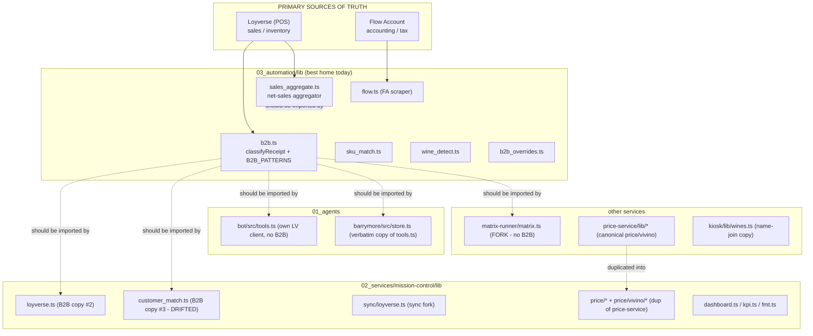

# Cross-Cutting Logic & Conventions

This guide is the reference for **shared business logic** in the Wine & Whiskey monorepo:
the rules and helpers that more than one package needs (B2B classification, sales
aggregation, SKU matching, wine detection, money/date formatting, billing cycles).

The owner's principle is explicit: **a cross-cutting rule must have exactly one
implementation, used everywhere.** Today many of these rules are copy-pasted across
package boundaries (`03_automation`, each `02_services/*`, `01_agents/*`) and several
copies have already silently drifted. This document records, for each concern:

1. the **canonical home** it should have,
2. **where the logic actually lives today**, and
3. the **duplicates to eliminate** (with file paths).

> ### Root cause (read this first)
> `03_automation`, every app under `02_services/*`, and every bot under `01_agents/*`
> are **separate npm packages with no shared internal package**. The only way to reuse
> a rule across that boundary today is to copy-paste it. Almost every finding below is a
> symptom of that one structural gap. The highest-leverage fix is to **stand up one
> shared workspace package** (npm/pnpm workspace or a TS path-aliased `00_shared/`) and
> make the shared modules the *only* entry points. Until that exists, the "Rules"
> section at the end is the stopgap that keeps copies in sync.

---

## Where cross-cutting code lives now

---

## 1. B2B / B2C classification — `classifyReceipt`

**The rule:** a Loyverse receipt is **B2B** if EITHER (a) any payment is of type
`BANK_TRANSFER_TYPE_ID`, OR (b) it is linked to a customer whose name matches a
`B2B_PATTERNS` substring. B2B is excluded from B2C ("продажи") figures.

| | |
|---|---|
| **Canonical home** | `03_automation/lib/b2b.ts` — exports `classifyReceipt`, `isB2BCustomerName`, `BANK_TRANSFER_TYPE_ID`, `B2B_PATTERNS`. Documented with provenance (patterns verified against the live Loyverse customer table). |
| **Persisted result** | `03_automation/sync_loyverse_receipts.ts` computes `is_b2b` / `is_bank_transfer` **once at ingest** using `b2b.ts` and writes them onto `inventory.loyverse_receipt`. The portal's `lib/dashboard.ts` and `pulse/page.tsx` read that column — they do **not** re-derive. This is the correct pattern: classify once, read the persisted boolean everywhere. |
| **Manual overrides** | `03_automation/lib/b2b_overrides.ts` (`receipt_number → canonical client`, plus `canonicalize()`) — reused by `sync_accounting`, `b2b_reserve`, `channels_diagnostic`. Keep as a single module. |

### Duplicates to eliminate

| File | Status | Action |
|---|---|---|
| `02_services/mission-control/lib/loyverse.ts` (lines ~15-30) | Copy #2. **Currently matches canonical** (22 patterns). Comment admits "keep in sync". | Replace with import from shared package. |
| `02_services/mission-control/lib/customer_match.ts` (lines ~21-29) | Copy #3. **DRIFTED — verified.** Adds `olabar, phuket kachatip, pinz, q squad, sukmesum, titov, volna pool`; **missing** `pinzerai, secret spot, shaman phuket`. So the FlowAccount→Loyverse customer matcher classifies a different set of clients as B2B than the nightly sync/dashboard/accounting. | Reconcile to canonical immediately, then delete and import. |
| `01_agents/bot/src/tools.ts` `getSales` | No B2B rule at all — sums **all** `SALE` receipts. | Apply `classifyReceipt`, or label the bot number as "gross POS total incl B2B & refunds". |
| `01_agents/barrymore/src/store.ts` | Verbatim copy of `bot/src/tools.ts` (header says "Копия из bot/src/tools.ts"). | Eliminate via shared module. |
| `02_services/matrix-runner/matrix.ts` | **Zero B2B classification — verified (`grep` count = 0).** A stale fork of `build_purchase_matrix.ts`, which now excludes B2B for B2C-only velocity. The live "Пересчитать матрицу" button therefore produces B2B-contaminated reorder numbers. | Re-copy current `build_purchase_matrix.ts` now; share long-term. |
| Inline re-assembly in `monthly_b2c_margin.ts`, `sync_dashboard.ts`, `sync_b2b.ts`, `sync_daily_revenue.ts`, `sync_loyverse_receipts.ts` | Import only the primitives and rewrite `hasBankTransfer \|\| isB2BCustomerName(...)` by hand. | Call `classifyReceipt()` instead. |
| `03_automation/identify_bestsellers.ts` | **Bug:** uses `isB2BCustomerName` ONLY, **omits the bank-transfer condition** — its split diverges for every card-less bank-transfer sale. | Call `classifyReceipt()`. |

> **Rule:** `classifyReceipt` is the only public entry point. Do **not** export the raw
> primitives (`BANK_TRANSFER_TYPE_ID`, `isB2BCustomerName`) for re-assembly elsewhere.

---

## 2. Sales aggregation / net-sales convention — `sales_aggregate`

**The rule (owner: "pulse = accounting до рубля"):** fetch `SALE` **+** `REFUND`
receipts, subtract refunds (sign −1), **exclude cancelled** receipts (`cancelled_at`).
Querying `receipt_type=SALE` alone is wrong — Loyverse silently **ignores** that param
(documented in `sync_accounting.ts`), so the response still contains `REFUND` rows.

| | |
|---|---|
| **Canonical home** | `03_automation/lib/sales_aggregate.ts` — its header declares it "the only place that should fetch + classify + aggregate". It nets refunds, skips cancelled, and uses `classifyReceipt`. **This is correct.** |
| **Respected by** | The portal's cached-table readers: `lib/dashboard.ts` (`aggregate()`) and `pulse/page.tsx` sign refunds −1 reading `inventory.loyverse_receipt`. |

### Problem: the canonical aggregator has effectively no consumers

- **Verified:** `sales_aggregate.ts` is imported by **exactly one** file —
  `03_automation/channels_diagnostic.ts` — which is itself an orphan (not wired into
  `package.json`).
- The high-traffic producers each roll their own `SALE`-only loop with **no refund or
  cancel handling**: `sync_dashboard.ts` (drives the Google "Status Check" sheet),
  `wine_matrix.ts`, `monthly_b2c_margin.ts`, `sync_daily_revenue.ts`,
  `identify_bestsellers.ts`. `grep refund|cancel` returns nothing in
  `sync_dashboard.ts` / `monthly_b2c_margin.ts`.
- **Consequence:** the legacy Google-Sheet Dashboard **overstates** revenue/GP/checks
  (it counts `REFUND` rows as positive sales) vs the native portal Dashboard. Same KPI,
  two answers, one wrong.

**Action:** migrate the intended consumers (`build_purchase_matrix`, `monthly_b2c_margin`,
`inventory_segmentation`, `b2b_reserve`, `category_margin_diagnostic`, `wine_matrix`,
`sync_daily_revenue`) onto `aggregateSales()`. Fix or retire `sync_dashboard.ts`.
Prefer **reading the cached `inventory.loyverse_receipt` table** over re-pulling Loyverse
for read-only analytics.

---

## 3. Loyverse REST client (fetch + pagination + retry)

| | |
|---|---|
| **Canonical home** | **Does not exist yet** — there is no `03_automation/lib/loyverse.ts`. |
| **Where it lives** | Re-implemented ~20 times: ~15 automation scripts each define their own `loyverseFetch` + cursor pagination, plus separate clients in `01_agents/bot/src/tools.ts`, `01_agents/barrymore/src/store.ts`, `02_services/matrix-runner/matrix.ts`, and two in mission-control (`lib/loyverse.ts`, `lib/sync/loyverse.ts`). |

### Issues

- **Only one fetcher has the transient-error retry.** `sync_loyverse_receipts.ts`
  carries the retry-on-empty-body fix (commit `a79cfb8`); the other ~15 still hard-fail
  on the same transient Loyverse response.
- **Two product/stock sync forks.** `02_services/mission-control/lib/sync/loyverse.ts`
  (the portal "Sync now" button — the portal's only write path to the mirror) is a
  hand-maintained copy of `03_automation/sync_inventory_loyverse.ts`. A pagination fix
  in one can regress the other, so manual sync and cron can write different stock.
- **Dead client.** `01_agents/bot/src/loyverse.ts` is never imported — a third copy.
  Delete it.
- **Live re-fetch + re-classify.** `02_services/mission-control/lib/loyverse.ts` scans
  Loyverse live (up to 30 pages/SKU, 5-min revalidate, **process-lifetime** customer
  name cache) and re-derives B2B for the SKU detail page. A brand-new B2B customer is
  misclassified until process restart, and the SKU "B2C 90d" can disagree with
  Dashboard/Pulse. Read from `inventory.loyverse_receipt(_line)` (`is_b2b` precomputed)
  instead.

**Action:** extract one Loyverse client (paginated, with the retry) into the shared
package; route analytics readers at the cached table; drop the dead client; collapse the
two sync forks into one shared module.

---

## 4. SKU matching — `sku_match` ✅ good

| | |
|---|---|
| **Canonical home** | `03_automation/lib/sku_match.ts` — token-set Jaccard + containment + Levenshtein-1, volume-aware. |
| **Used by** | `03_automation/sync_inventory_flow.ts`, `03_automation/rematch_unmapped.ts`. |

This is the **target pattern**: one well-commented matcher, imported (not copied). No
action needed within `03_automation`. When the shared package exists, expose it there so
cross-package consumers can reuse it too.

### Related: inventory ↔ wine_items (Vivino) name join — NOT shared

The fragile name-normalization that bridges Loyverse inventory to Vivino enrichment is
hand-rolled in two places:
- `02_services/kiosk/lib/wines.ts` (its comment: "Same approach as mission-control's
  wine-matrix/queries.ts")
- `02_services/mission-control/lib/wine-matrix/queries.ts`

**Action:** add a persistent `sku_id ↔ wine_items` join key/view in Supabase so consumers
do a real join, not duplicated normalized-name matching.

---

## 5. Wine attribute detection — `wine_detect`

| | |
|---|---|
| **Canonical home** | `03_automation/lib/wine_detect.ts` — `detectGrape`, `GRAPE_ORDER`, `detectRedCountryRegion`. |
| **Used by** | `build_purchase_matrix.ts`, `sync_sku_wine_attrs.ts`, `wine_breakdown.ts`. |

### Duplicates / parallel implementations

- `02_services/mission-control/lib/price/classify.ts` (`WHITE_RX` / `RED_RX`) carries the
  **same grape vocabulary** for price-list typing — a separate concern, but the grape
  list and red/white logic can drift.
- Both bots re-invent wine/spirits/beer classification in `getInventorySummary`
  (`bot/src/tools.ts`, `barrymore/src/store.ts`) with hardcoded category Sets +
  keyword/volume regex, so the bot's "всего бутылок" can disagree with the inventory page.

**Action:** when the shared package exists, move the grape vocabulary + `detectGrape`
there so the matrix pipeline, the price-list classifier, and the bots consume one list.

---

## 6. Customer matching (FlowAccount → Loyverse) — `customer_match`

| | |
|---|---|
| **Home** | `02_services/mission-control/lib/customer_match.ts` (Jaccard + containment scoring). The matching algorithm itself is fine and portal-local. |
| **Problem** | It embeds its **own** `B2B_PATTERNS` copy — the one that has **drifted** (see §1). The matcher uses the pattern list as a confidence bonus, so it now rewards a different set of names than the canonical classifier. |

**Action:** keep the matching algorithm; delete the local `B2B_PATTERNS` and import the
canonical one (interim: reconcile to canonical and add a deep-equal test).

---

## 7. Money / VAT / number formatting

| | |
|---|---|
| **Canonical home** | `02_services/mission-control/lib/fmt.ts` — currently has `fmtDate` / `fmtDateTime` but **no money helper**. |
| **Where it lives** | THB/money is inlined **~35 times** across app/components/lib with mixed locales (`en-US` "1,234" vs `ru-RU` "1 234"), mixed rounding (`Math.round` vs `maximumFractionDigits: 0` vs `: 2`), and a hand-typed `฿` prefix. Two pages define local `const THB =` / `const money =` helpers. |

**Action:** add `fmtTHB` / `fmtMoney` / `fmtInt` / `fmtPct` to `lib/fmt.ts` with one agreed
locale + rounding policy and replace the inline `toLocaleString` calls.

> **VAT note** (separate concern, already documented in MEMORY): when a PO has no VAT
> broken out, treat the total as **VAT-inclusive** and back out 7%. Exceptions live in
> `08_config/po_exclude.json`. This rule must stay singular too.

---

## 8. Date / timezone / billing-cycle logic

The store runs on **Asia/Bangkok (UTC+7)**. There is no single tz helper.

| Concern | Where it lives | Issue |
|---|---|---|
| Bangkok day boundary | `lib/kpi.ts` uses `BKK_OFFSET_MIN = 7*60`; `sales_aggregate.ts` uses `T00:00:00+07:00` string literals; `sync_harvest_sales.ts` uses `Date.now()+7*3_600_000`; `flow.ts` passes `timezoneId:'Asia/Bangkok'`. | Multiple idioms → day-boundary off-by-one risk. Add one `bangkokDayRange(ymd)` / `bangkokToday()`. |
| **Supplier billing cycle (5th-to-5th)** | `function periodRange(period, startDay)` is **duplicated** in `suppliers/[id]/report/page.tsx` and `suppliers/[id]/report/sales/page.tsx` (logically identical — **verified, both files**). | This is the **owner-flagged sensitive** Harvest consignment settlement math. Extract to one `lib/billing-cycle.ts`. |
| KPI windows | `lib/kpi.ts` has a **different** `periodRange(key, now)` — same name, different signature. | Confusing collision; rename or namespace. |

> **Consignment source of truth** (MEMORY): the monthly Harvest **settlement PO** is the
> source of truth; deliveries are stock adjustments, not POs. This anchoring is correct
> but depends on a fragile PO-name string match (see §9).

---

## 9. Supplier ↔ purchase_orders join

`purchase_orders.supplier` is **free text**, joined to the supplier row by
`name.trim().toLowerCase()` in `pulse/page.tsx`, `suppliers/page.tsx`, and
`suppliers/purchase-orders/page.tsx`. On any mismatch the lookup **silently defaults**
`payment_terms_days=0` and `type='regular'` — so an unmatched consignment supplier is
**not** excluded from cashflow (double-counts consignment) and a regular supplier's
payment date collapses to `order_date`. Both quietly skew the cash-basis Pulse P&L with
no error surfaced.

**Action:** add a `supplier_id` FK (or a normalized-name resolution table) and **surface
unmatched PO names in the UI** instead of silently defaulting.

---

## 10. Price-list parsers & Vivino enrichment

| | |
|---|---|
| **Canonical owner** | `02_services/price-service/lib/*` — per `CLAUDE.md`, price-service is the storefront's authoritative Vivino source (the `STOREFRONT_API_KEY`-gated public API). |
| **Whole-subsystem duplicate** | `02_services/mission-control/lib/price/*` is a **byte-identical** copy: all 17 parsers, `classify.ts`/`claude.ts`/`extract.ts`/etc., and the 6 Vivino files (identical except the supabase import path). **Both** services also expose `app/api/public/vivino/{lookup,by-url}` against the **same** Supabase project + cache tables. |

**Action:** keep the public Vivino endpoint in price-service; drop mission-control's
duplicate public routes; share the parser/Vivino lib via the shared package.

---

# Rules

Codified conventions. Follow these so future work does not re-introduce drift.

### Source of truth
1. **Loyverse (POS) and Flow Account (accounting) are the only primary sources.** Anything
   derived must trace back to them. Never invent a parallel database or a second cache.
   `inventory.loyverse_receipt` is the single receipt cache; `inventory.loyverse_stock` →
   `v_sku_breakdown` is the single on-hand path. (The dead `public.receipts` /
   `receipt_items` tables have no readers — retire them.)
2. **Classify B2B once, read the boolean everywhere.** Use `classifyReceipt` from one
   module. Read the persisted `is_b2b` column; do not re-derive from Loyverse REST.
3. **Net-sales convention is fixed:** `SALE + REFUND`, subtract refunds, exclude
   `cancelled_at`. Never aggregate `SALE`-only. Route through `sales_aggregate.ts`.
4. **The purchase matrix uses B2C-only velocity** (B2B excluded). The live matrix-runner
   output must equal the `build_purchase_matrix.ts` CLI output.

### Shared logic / DRY
5. **One implementation per cross-cutting rule.** B2B classifier, Loyverse client, net-sales
   aggregator, SKU matcher, wine/grape detection, money/tz/billing-cycle helpers each have
   exactly one home. Import — never copy — across packages.
6. **No "synchronize manually" copies.** If you find a `синхронизировать вручную` / "keep in
   sync" comment, that is a bug to fix, not a pattern to follow. Until the shared package
   exists, if you *must* copy, add a deep-equal test that fails the build on drift (start
   with `B2B_PATTERNS`).
7. **Do not export raw primitives for re-assembly.** Export the composed function
   (`classifyReceipt`, `aggregateSales`), not the building blocks that let callers rebuild
   the rule by hand.
8. **Read-only analytics reads the cached tables**, it does not re-pull Loyverse REST.

### Data model
9. **Join on keys, not name strings.** Resolve `purchase_orders → supplier` and
   `sku → wine_items` via FKs / a resolution table/view. Surface unmatched rows in the UI;
   never silently default.
10. **Business constants live in config, not source.** Move `PLAN_START_YM`, `PLAN_MULT`,
    `HARVEST_PO_CUTOFF`, the fixed-cost buffer default, the sheet ID + tab schema into
    `08_config` / a settings table so rolling into a new year is a config edit.

### Product / UI
11. **Portal UI is in English** (non-Russian-speaking staff). Code comments may be Russian.
12. **W&W logo is large and prominent** on all covers/materials (default cover size ≥ 84–96px).
13. **Shareable docs (payslips, branded cards) export as one long single-page PDF** (`@page`
    sized to content), no pagination — for messengers.
14. **Creative files:** `<topic>_YYYY-MM-DD.<ext>` (+ `_preview.png`) in
    `05_creative/output/`, HTML-only, committed so Railway picks them up.

### Folder & deployment
15. **Respect the folder table in `CLAUDE.md`.** A file that does not fit → stop and discuss
    before committing.
16. **Every service must be committed.** `02_services/kiosk` currently has **0 git-tracked
    files (verified)** and is not gitignored — it can never deploy via push-to-main. Commit
    it (its `.env.local` is already ignored).
17. **No strays.** Don't leave debug/probe/one-shot artifacts in the tree
    (e.g. the completed `03_automation/_fix_po_totals.ts` is a deletion candidate). Wire real
    scripts into `package.json`.
18. **Each bot needs its own `.gitignore`.** Don't rely solely on the root ignore for secrets.

### Git
19. **When asked to commit, also push** to `origin main` (don't ask separately). Branch first
    if on `main` per the agent harness rules.
20. End commit messages with the `Co-Authored-By` trailer.
