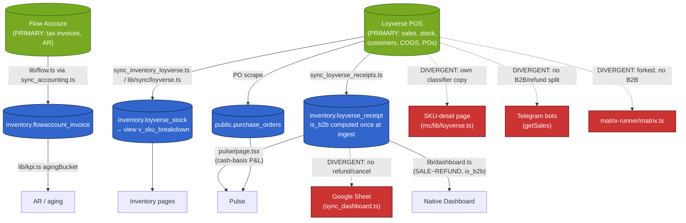

# Data Sources — Canonical Source-of-Truth Reference

This document defines the **single authoritative origin** for every key
business metric and entity in the Wine & Whiskey store OS. It exists so that
any number shown on a dashboard, in a bot reply, in the Google Sheet, or in an
accounting export can be traced back to one upstream system — and so that, when
two surfaces disagree, there is a written rule for which one is right.

## The rule

> **Every derived number must trace back to a PRIMARY system.** There are
> exactly two primary systems of record:
>
> 1. **Loyverse (POS)** — sales, receipts, inventory on hand, COGS/line cost,
>    customers, payment types, purchase-order dashboard.
> 2. **Flow Account (accounting/tax)** — issued tax invoices, AR, accounting
>    export.
>
> Nothing else is allowed to *invent* truth. A service may **cache** Loyverse/Flow
> data (e.g. the `inventory.loyverse_receipt` mirror table), and it may **derive**
> figures from that cache, but the derivation must use the canonical rules below.
> If a surface re-computes a metric with its own arithmetic, it is a bug to be
> reconciled, not a second source of truth.

### Net-sales convention (the one definition of "revenue")

Encoded once in `03_automation/lib/sales_aggregate.ts` and respected by the
portal's cached-table readers:

- Fetch **SALE + REFUND** receipts (not `SALE` only).
- **Subtract** refunds (REFUND rows count negative).
- **Exclude** cancelled receipts (`cancelled_at` set).
- Split **B2C vs B2B** using `03_automation/lib/b2b.ts::classifyReceipt`
  (a receipt is B2B if it has a Bank-Transfer payment **OR** its customer name
  matches `B2B_PATTERNS`).

Owner's shorthand: *revenue excludes cancelled, minus refunds — "pulse = accounting до рубля".*

### B2B classification (the one definition of "wholesale")

`03_automation/lib/b2b.ts` is the **single source of truth**. It exports
`BANK_TRANSFER_TYPE_ID`, `B2B_PATTERNS`, `isB2BCustomerName`, and
`classifyReceipt`. It is computed **once at ingest time** and persisted as the
`is_b2b` column on `inventory.loyverse_receipt`, so all portal readers share one
classification result rather than re-deriving it.

---

## Source-of-truth map

| Metric / Entity | Primary system | Ingested by (script / module) | Stored in | Canonical anchor | Current divergence to fix |
|---|---|---|---|---|---|
| **Retail (B2C) sales** | Loyverse POS | `03_automation/sync_loyverse_receipts.ts` (`npm run inv:receipts`) | `inventory.loyverse_receipt` (+`_line`) | rows where `is_b2b=false`, SALE−REFUND signed; read by `lib/dashboard.ts` aggregate + `pulse/page.tsx` | `sync_dashboard.ts` (Google Sheet) has **no refund/cancel handling** → overstates; both Telegram bots' `getSales` sum all SALE incl. B2B/refunds; SKU-detail page re-derives live |
| **Wholesale (B2B) sales** | Loyverse POS | `sync_loyverse_receipts.ts`; `is_b2b` set via `lib/b2b.ts::classifyReceipt` | `inventory.loyverse_receipt` where `is_b2b=true` | persisted `is_b2b` column | `customer_match.ts` `B2B_PATTERNS` has **drifted** from canonical; `identify_bestsellers.ts` omits the bank-transfer condition; bots apply no B2B split |
| **B2B classification rule** | — (business rule) | `03_automation/lib/b2b.ts` (`classifyReceipt` + `B2B_PATTERNS` + `BANK_TRANSFER_TYPE_ID`) | persisted as `is_b2b` on the receipt mirror | imported by ~13 automation scripts | **4 copies total**: `mc/lib/loyverse.ts` (in-sync), `mc/lib/customer_match.ts` (**DRIFTED**), bots (no copy, no rule). Rule re-assembled inline in ~6 scripts |
| **Net-sales convention** | — (business rule) | `03_automation/lib/sales_aggregate.ts` | declared single aggregator | SALE+REFUND, subtract refunds, skip `cancelled_at` | Only **1 consumer** (`channels_diagnostic.ts`, itself an orphan). `wine_matrix` / `monthly_b2c_margin` / `sync_daily_revenue` / `sync_dashboard` / `identify_bestsellers` roll their own SALE-only logic |
| **Inventory on hand** | Loyverse POS | cron: `03_automation/sync_inventory_loyverse.ts`; portal "Sync now": `mc/lib/sync/loyverse.ts` | `inventory.loyverse_stock` → view `v_sku_breakdown` | single read path via `v_sku_breakdown` | No divergence in **reads**. Two **write** paths (`lib/sync/loyverse.ts` vs `sync_inventory_loyverse.ts`) are copy-paste forks that can drift |
| **COGS / unit-economics margin** | Loyverse POS | `sync_loyverse_receipts.ts` (line `cost_total`) | `inventory.loyverse_receipt_line.cost_total` | per-receipt line cost; portal GM% reference | Pulse **headline GP = revenue − supplier PO cash-out** (deliberately cash-basis, a *different* definition from unit-economics GP). Both documented but easily confused |
| **Expenses / fixed costs** | Portal table + Google Sheet | bot writes Sheet `Expenses!A:G`; `inventory.fixed_cost` in portal | `inventory.fixed_cost`; Google Sheet "Expenses" tab | `dashboard.ts` / `pulse` fixed-cost model | Sheet ID + tab schema hardcoded in bot + ~10 automation scripts; planned migration to portal would orphan the bot write path |
| **Tax invoices / accounting export** | Flow Account | `03_automation/sync_accounting.ts` via `lib/flow.ts` (Playwright) + `classifyReceipt` + `b2b_overrides` | `inventory.flowaccount_invoice` | unpaid FA invoices = AR (not revenue until paid) | Consistent with canonical — **no divergence** |
| **AR / aging** | Flow Account | `lib/flow.ts` (scraped) | `inventory.flowaccount_invoice` | unpaid invoices bucketed via `lib/kpi.ts agingBucket` | Correct — Flow access centralized in `lib/flow.ts`, no separate truth invented |
| **Customers** | Loyverse POS | live REST (`mc/lib/loyverse.ts`, `customer_match.ts`); FA→LV matcher in `customer_match.ts` | Loyverse customer table (live); matched names on receipts | `B2B_PATTERNS` name match → `is_b2b` | `customer_match.ts` B2B list **adds** olabar/pinz/titov/sukmesum/volna pool/phuket kachatip/q-squad and is **missing** pinzerai/secret spot/shaman phuket vs canonical |
| **Suppliers** | Portal table (manual + scrape) | portal supplier CRUD; PO scrape | `public.suppliers` | `payment_terms_days`, `type` (regular/consignment) | PO→supplier joined by **name string** (`name.trim().toLowerCase()`); a miss silently defaults `payment_terms_days=0`, `type='regular'` |
| **Purchase orders / payables** | Loyverse PO dashboard (scraped) | PO scrape | `public.purchase_orders` / `purchase_order_items` (shared by portal + bots) | cash-out / supplier payment dates | Name-string join to suppliers; unmatched POs silently skew Pulse cash-basis P&L with no error surfaced |
| **Consignment (Harvest)** | Loyverse PO (monthly settlement) | `sync_harvest_sales.ts`; Pulse reads the settlement PO | `public.purchase_orders` (the settlement PO) | monthly settlement PO = source of truth; deliveries excluded as stock adjustments | Anchoring is **correct**, but depends on the same fragile PO-name match to identify the consignment supplier |
| **Purchase matrix / reorder velocity** | Loyverse receipts, B2C-only | `03_automation/build_purchase_matrix.ts` (`classifyReceipt`, B2B excluded) | Google Sheet matrix | B2C-only velocity | `matrix-runner/matrix.ts` is a **fork with no B2B classification** → the live "Пересчитать матрицу" button gives a B2B-contaminated plan |
| **Vivino enrichment (storefront)** | price-service public API | `price-service` Vivino lib | `public.wine_items` + Vivino cache (Supabase `arbturzdpqvulsqwqpbd`) | `price-service /api/public/vivino/{lookup,by-url}` (STOREFRONT_API_KEY-gated) | `mission-control` duplicates the **same routes + whole Vivino lib** against the same tables — two code paths for one contract |
| **Dead / dual cache** | — | `03_automation/sync_receipts.ts` (`npm run receipts`) | `public.receipts` / `receipt_items` | — | **Write-only, no readers** (verified). Retire it; `inventory.loyverse_receipt` is the single receipt cache |

---

## Data-flow overview

Solid green/blue paths are correct (cache the primary, derive with canonical
rules). **Dashed red paths re-derive metrics with their own arithmetic and are
the known divergences to fix.**

---

## Known staleness & divergence risks

These are concrete, verified issues where a surface either caches stale data or
computes a metric a second (and sometimes wrong) way. Fix by routing every
producer through the canonical rules and the persisted `is_b2b` column.

### Source-of-truth divergences (wrong numbers today)

1. **Google-Sheet Dashboard overstates revenue.** `sync_dashboard.ts` has no
   refund/cancel handling and Loyverse silently ignores `receipt_type=SALE`, so
   REFUND rows are counted as positive sales. The "Status Check W&W" sheet
   reports higher revenue/GP/checks than the native portal Dashboard.
   *Fix:* retire the sheet (native Dashboard exists) or read the cached
   `inventory.loyverse_receipt` table instead of re-deriving.

2. **B2B customer list has drifted** in
   `mission-control/lib/customer_match.ts` — it adds olabar/pinz/titov/
   sukmesum/volna pool/phuket kachatip/q-squad and is missing pinzerai/secret
   spot/shaman phuket relative to canonical `03_automation/lib/b2b.ts`. So the
   FA→LV customer matcher classifies different clients as B2B than the nightly
   sync, Dashboard, and accounting. (`mc/lib/loyverse.ts` still matches
   canonically.)

3. **Live purchase matrix is B2B-contaminated.** `matrix-runner/matrix.ts` is a
   manual fork of `build_purchase_matrix.ts` that never received the B2C-only
   velocity fix and applies **zero** B2B classification. The live
   "Пересчитать матрицу" button therefore differs from the canonical CLI output
   — a divergence in the purchase plan, which is the owner's primary metric
   (turnover).

4. **Telegram bots report a different revenue than the dashboard.** Both bots'
   `getSales` sum all `SALE` receipts with **no** B2B exclusion, refund netting,
   or cancel handling — including in the daily morning briefing the whole team
   sees. *Fix:* read from `inventory.loyverse_receipt` where `is_b2b` is already
   computed, or explicitly label the figure as "gross POS total incl. B2B & refunds".

5. **SKU-detail page re-classifies live.** `mc/lib/loyverse.ts` re-scans Loyverse
   REST (up to 30 pages/SKU) and re-derives B2B with its own pattern copy, so a
   brand-new B2B customer is misclassified until process restart and the SKU
   "B2C 90d" can disagree with Dashboard/Pulse. *Fix:* read line-level B2C from
   `inventory.loyverse_receipt_line` joined on `is_b2b=false`.

6. **`identify_bestsellers.ts` omits the bank-transfer condition** entirely, so
   its B2C/B2B split diverges from every other script for any card-less
   bank-transfer sale.

### Staleness risks

7. **Receipts cache can lag.** In `lib/registry.ts` the Loyverse receipts source
   is `runnable:'manual'` (`npm run inv:receipts`, 30-day window) while
   products/stock and Flow run on an 8-hour cron. Pulse and Dashboard read
   exclusively from the cached `inventory.loyverse_receipt` table, so if nobody
   runs the sync, headline revenue/GP/B2B silently lag reality (only the
   DataFreshness bar hints at it). *Fix:* put receipts on the same 8h cron and
   surface a staleness warning when the last successful sync is older than the
   cadence.

8. **Two write paths to the stock mirror.** `mc/lib/sync/loyverse.ts` (portal
   "Sync now") and `03_automation/sync_inventory_loyverse.ts` (cron) are
   copy-paste forks, so a fix to category/stock mapping in one can leave the
   other writing different rows from the same Loyverse account.

9. **Process-lifetime caches in `mc/lib/loyverse.ts`.** The customer id→name map
   is cached for the life of the server process; new Loyverse customers don't
   appear until restart.

10. **Dead second receipt cache.** `public.receipts` / `receipt_items`
    (written by `sync_receipts.ts`) has no readers — a stale duplicate of
    Loyverse data that still costs an API pull. Retire it.

### Fragile-key risks (silent failures as data grows)

11. **PO → supplier join is by normalized name string**, not a foreign key. On
    any name mismatch the lookup silently defaults `payment_terms_days=0` and
    `type='regular'`, so an unmatched **consignment** supplier would not be
    excluded from cashflow (double-counting) and an unmatched **regular**
    supplier's payment date collapses to `order_date` — both quietly skew the
    cash-basis P&L with no error surfaced. *Fix:* add a `supplier_id` FK /
    resolution table and surface unmatched POs in the UI.

12. **Inventory ↔ wine_items (Vivino) bridge** is hand-rolled name
    normalization duplicated in `kiosk/lib/wines.ts` and
    `wine-matrix/queries.ts`. *Fix:* a persistent SKU↔wine_items join key/view.

---

## Maintaining this document

When you add a new metric, channel, service, or sync script, add a row to the
**source-of-truth map** above and answer four questions:

1. Which **primary system** (Loyverse or Flow) does it ultimately come from?
2. Which **script/module ingests** it?
3. **Where is it stored** (which table/view)?
4. Does it **re-derive** any existing metric with its own arithmetic? If yes,
   route it through `lib/sales_aggregate.ts` / `classifyReceipt` / the persisted
   `is_b2b` column instead — and do not create a new copy of `B2B_PATTERNS`.
