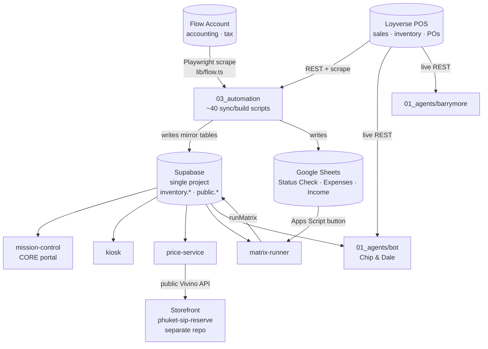

# Services, Agents & Automation — Reference Catalog

A complete catalog of every deployable service, Telegram agent, and automation script in
the Wine & Whiskey monorepo. For each entry: what it is, where it lives, what it does, its
deploy status, and key entry points / data sources.

> **Source of truth:** Loyverse (POS — sales, inventory) and Flow Account (accounting,
> tax). Everything downstream should trace back to these two systems and to the single
> Supabase project they are mirrored into. Where a component invents its own answer to a
> question already answered upstream, it is flagged below under **Consolidation**.

---

## 1. System map

All services point at the **same Supabase project**. No component stands up a separate
database; divergences are in the *logic applied on top*, not in storage.

---

## 2. Web services (`02_services/`)

| Service | Path | Purpose | Deploy status | Key entry points |
|---|---|---|---|---|
| **mission-control** | `02_services/mission-control` | CORE Next.js App-Router portal (~350 files). Dashboard, Pulse P&L, inventory, price-list manager, customers, sales, suppliers, wine-matrix, promo, reactivation, creative library, product images, brand assets, design system. Server-first (RSC reads Supabase directly). | **Live** on Railway (push to main). | Routes under `app/(portal)/m/*`; `lib/supabase.ts` (schema-scoped clients), `lib/registry.ts` (nav + data-source registry), `lib/dashboard.ts`, `lib/loyverse.ts`, `lib/price/`, `app/api/m/sync/[source]/route.ts` (web Sync-now), `app/api/public/vivino/*`. |
| **price-service** | `02_services/price-service` | Next.js price-list manager: parse supplier price lists (17 parsers + Vivino enrichment), serve the **public Vivino lookup API** that the external Lovable storefront consumes. | **Live** on Railway. | `lib/parsers/`, `lib/vivino/`, `app/api/public/vivino/lookup`, `app/api/public/vivino/by-url` (gated by `STOREFRONT_API_KEY` via `x-api-key`). |
| **trendwatch** | `02_services/trendwatch` | Built reels/creative trend tool (Runway generation). Tracked in git (~58 files). Does NOT read Loyverse/inventory. | **Built, NOT deployed.** Registry marks it `building`; portal links to `trendwatch-production.up.railway.app` which likely 404s. Needs `TRENDWATCH_SECRET`/`PASSWORD`, `RUNWAY_API_TOKEN`, a Storage bucket. | — |
| **matrix-runner** | `02_services/matrix-runner` | Tiny Express webhook so the Google Sheets "Пересчитать матрицу" menu button can trigger the purchase-matrix build in-process. Self-contained for Railway Root-Directory deploy. | **Live** on Railway (separate root dir). | `server.ts` (`POST /run`, `/api/health`), `matrix.ts` (`runMatrix`), `wine_detect.ts`. |
| **kiosk** | `02_services/kiosk` | Read-only in-store sommelier display: browse catalog with Vivino enrichment. Strict read-only, 60s cache, graceful degradation when env missing. | **NOT committed to git** (0 tracked files; not gitignored — simply never `git add`-ed). Cannot deploy via push-to-main until committed. | `lib/wines.ts` (reads `inventory.v_sku_breakdown` + `public.wine_items`), `/api/health`. |

### Service consolidation opportunities

- **price-service vs mission-control price subsystem (high).** `mission-control/lib/price`
  is a near-verbatim copy of `price-service/lib`: all **17 parsers byte-identical**;
  `classify/claude/extract/file-types/pdf-render/pdf/types-display` identical; the 6 Vivino
  files identical except the supabase import path. **Both** services also expose
  `app/api/public/vivino/{lookup,by-url}` against the **same** Supabase tables. CLAUDE.md
  designates price-service as the storefront's Vivino owner. Fix: keep the public Vivino API
  in price-service only, drop mission-control's duplicate public routes, and share
  parsers/Vivino via a shared package.
- **matrix-runner vs build_purchase_matrix (high, already drifted).**
  `matrix-runner/matrix.ts` is a hand-copied fork of `03_automation/build_purchase_matrix.ts`
  (README: "копии файлов… синхронизируй обе копии"). The automation original was rewritten
  to exclude B2B receipts (B2C-only velocity via `lib/b2b.ts::classifyReceipt`); the
  matrix-runner copy still aggregates **all** receipts with **no B2B classification**. The
  live "Пересчитать матрицу" button therefore produces B2B-contaminated reorder numbers that
  differ from the CLI. `wine_detect.ts` is also a byte-identical copy. Fix: re-copy the
  current automation logic now; long term, import shared matrix logic so the 63KB script
  lives once.
- **kiosk ↔ wine-matrix name join (medium).** `kiosk/lib/wines.ts` reimplements the
  inventory↔`wine_items` name-normalization join already in
  `mission-control/lib/wine-matrix/queries.ts`. Fix: add a persistent SKU→`wine_items` join
  key/view.
- **matrix-runner scaling (medium).** Synchronous 3–4 min request risks the Apps Script
  6-min `UrlFetchApp` ceiling; in-process lock breaks above one replica. Move to a
  202 + job_id + poll pattern.

---

## 3. Telegram agents (`01_agents/`)

| Agent | Path | Purpose | Deploy status | Key entry points |
|---|---|---|---|---|
| **Chip & Dale** (staff ops bot) | `01_agents/bot` | grammY + Anthropic agentic bot. Answers store questions via a Claude tool loop over the Loyverse REST API + Supabase `purchase_orders`; records expenses to Google Sheet; posts a morning briefing on cron. | **Live** on Railway (nixpacks). | `src/index.ts` (bot + cron), `src/tools.ts` (Loyverse/store tools), `src/sheets.ts` + `src/expenses.ts` (Sheets write), `src/briefing.ts`. |
| **Barrymore** (secretary bot) | `01_agents/barrymore` | grammY + Anthropic bot for tasks/chronicle/notes (own Supabase tables), Google Calendar, OpenAI Whisper voice transcription. Re-exposes the same store tools as the ops bot. | **Written, NOT deployed.** Needs `BARRYMORE_BOT_TOKEN`, `BARRYMORE_USERS`, `BARRYMORE_CHAT_ID`, `OPENAI_API_KEY`, `GOOGLE_CALENDAR_REFRESH_TOKEN`, and migrations 001/002 applied. No per-bot `.gitignore`. | `src/index.ts`, `src/agent.ts`, `src/store.ts` (copy of bot's tools.ts), `migrations/001_init.sql`. |

### Agent consolidation opportunities

- **`barrymore/src/store.ts` is a verbatim copy of `bot/src/tools.ts` (high).** Header says
  "Копия из bot/src/tools.ts". Already drifted (SPIRITS keyword list, GP divide-by-zero
  guard). Extract into one shared store-tools module.
- **Bot sales definition diverges from source of truth (high).** Both bots' `getSales` sum
  every `receipt_type=SALE` with **no B2B exclusion, no refund netting, no cancelled
  handling** — so the team-wide morning briefing reports a different revenue than the
  Dashboard/Pulse. Read from the persisted `inventory.loyverse_receipt` (`is_b2b` already
  computed) or share `classifyReceipt`.
- **Dead third Loyverse client (medium).** `bot/src/loyverse.ts` is never imported — a third
  copy of the Loyverse access pattern (the only one with a cache). Delete or fold the cache
  into the shared client.
- **Duplicated infra (low).** `railway.toml`, package.json, Bangkok-time math, and the
  "send HTML, fall back to plain text" helper are re-implemented per bot. Factor an
  `01_agents/common` layer.

---

## 4. Automation scripts (`03_automation/`)

Run via root `package.json` npm scripts (`npm run <name>`). All load env from
`.env.local`. Source codes: **LV** = Loyverse REST, **FA** = Flow Account (Playwright via
`lib/flow.ts`), **SHEETS** = Google Sheets, **SUPA** = Supabase mirror tables.

### 4.1 Wired npm scripts (root `package.json`)

| npm script | File | What it does | Reads |
|---|---|---|---|
| `dashboard` | `sync_dashboard.ts` | Writes the "Status Check W&W" Google Sheet (revenue/GP/B2B/checks). | LV → SHEETS |
| `matrix` | `wine_matrix.ts` | Builds the wine matrix sheet/output. | LV |
| `orders` | `scrape_purchase_orders.ts` | Scrapes the Loyverse PO dashboard into `purchase_orders`/`purchase_order_items`. | LV (scrape) → SUPA |
| `b2b` | `sync_b2b.ts` | B2B sales sync/report. | LV → SUPA/SHEETS |
| `suppliers` | `sync_suppliers.ts` | Syncs supplier list/data. | LV/SHEETS → SUPA |
| `receipts` | `sync_receipts.ts` | Pulls Loyverse receipts into `public.receipts`/`receipt_items`. **(dead path — see below)** | LV → SUPA |
| `harvest` | `sync_harvest_sales.ts` | Harvest consignment sales sync (per-supplier billing cycle). | LV → SUPA |
| `daily` | `sync_daily_revenue.ts` | Writes a Daily revenue tab to Google Sheets. | LV → SHEETS |
| `sync:all` | `sync_dashboard.ts` + `wine_matrix.ts` | Convenience: dashboard then matrix. | LV |
| `trends` | `sync_trends.ts` | Social/trend metrics sync. | external → SUPA/SHEETS |
| `discover-accounts` | `discover_trend_accounts.ts` | Discovers trend accounts to watch. | external |
| `bestsellers` | `identify_bestsellers.ts` | Identifies bestsellers. | LV |
| `accounting` | `sync_accounting.ts` | Monthly accounting export (3-sheet workbook) via Flow + B2B classifier + overrides. | FA + LV → SHEETS |
| `schedule` | `build_manager_schedule.ts` | Builds the manager schedule. | LV/SUPA |
| `inv:loyverse` | `sync_inventory_loyverse.ts` | Syncs Loyverse items/categories/stock into the mirror (`inventory.sku`, `loyverse_stock`). | LV → SUPA |
| `inv:flow` | `sync_inventory_flow.ts` | Syncs Flow Account invoices into `inventory.flowaccount_invoice` (+ SKU match via `lib/sku_match.ts`). | FA → SUPA |
| `inv:receipts` | `sync_loyverse_receipts.ts` | **Canonical receipt sync:** writes `inventory.loyverse_receipt`(+`_line`) with `is_b2b`/`is_bank_transfer`/`cost_total` computed once via `lib/b2b.ts`; nets refunds, purges cancelled; has transient-error retry. | LV → SUPA |
| `inv:all` | the three `inv:*` above | Full inventory + receipts sync. | LV + FA → SUPA |
| `sync:sku-wine` | `sync_sku_wine_attrs.ts` | Derives grape/country/region SKU attrs via `lib/wine_detect.ts`. | SUPA |

### 4.2 Shared libraries (`03_automation/lib/`)

| File | Role | Adoption |
|---|---|---|
| `b2b.ts` | **Canonical B2B classifier** — `classifyReceipt` + `isB2BCustomerName` + `B2B_PATTERNS` + `BANK_TRANSFER_TYPE_ID`. | Imported by ~13 automation scripts. **But** copied (and drifted) into `mc/lib/loyverse.ts` and `mc/lib/customer_match.ts`; bots carry no copy at all. |
| `b2b_overrides.ts` | Manual receipt→canonical-client tagging + `canonicalize()`. | Reused by `sync_accounting`, `b2b_reserve`, `channels_diagnostic`. |
| `flow.ts` | Flow Account Playwright scraper (`openFlow`/`listInvoices`/`listReceipts`). | Single home for FA access. Clean. |
| `sales_aggregate.ts` | **Declared single aggregator** — fetch SALE+REFUND, net refunds, skip cancelled, classify via `classifyReceipt`. Encodes the correct net-sales convention. | **Orphan: imported by only `channels_diagnostic.ts`** (itself unwired). The ~7 intended consumers still roll their own. |
| `sku_match.ts` | Fuzzy SKU matcher (token Jaccard + containment + Levenshtein). | Shared by `sync_inventory_flow` + `rematch_unmapped`. Good. |
| `wine_detect.ts` | Grape/country/region detection. | Reused by `build_purchase_matrix`, `sync_sku_wine_attrs`, `wine_breakdown`. (mission-control can't import it → has its own `lib/price/classify.ts`.) |

### 4.3 Unwired scripts (NOT in `package.json`)

These exist in `03_automation/` but no npm script references them; run (if at all) via `npx
tsx`. Several are diagnostics or completed one-shots.

`_fix_po_totals.ts` (completed one-shot data fix — deletion candidate), `b2b_anonymous_audit.ts`,
`b2b_reserve.ts`, `build_purchase_matrix.ts` (the canonical matrix logic — invoked by import
guard / forked into matrix-runner), `category_margin_diagnostic.ts`, `channels_diagnostic.ts`,
`create_cashflow.ts`, `create_cashflow_rolling.ts`, `export_creative.ts`, `export_po_items.ts`,
`generate_dashboard.ts` (overlaps `sync_dashboard.ts`, writes self-contained HTML),
`inventory_segmentation.ts`, `monthly_b2c_margin.ts`, `read_income.ts`, `rematch_unmapped.ts`,
`sync_company_account_offsets.ts`, `sync_personal_balance.ts`, `wine_breakdown.ts`.

### Automation consolidation opportunities

- **No shared client/config layer (high).** ~20 scripts each reimplement
  `loyverseFetch` + pagination, ~22 re-do Google OAuth refresh, ~15 re-call
  `createClient()`, every script re-does `dotenv.config`. Only `sync_loyverse_receipts.ts`
  has the transient-error retry. Extract `lib/loyverse.ts`, `lib/sheets.ts`,
  `lib/supabase.ts`, `lib/env.ts` (ideally shared across services).
- **Two revenue conventions (high).** `sales_aggregate.ts` nets refunds + skips cancelled
  (correct); the live high-traffic scripts (`sync_dashboard`, `wine_matrix`,
  `monthly_b2c_margin`, `sync_daily_revenue`, `identify_bestsellers`) query SALE-only with
  no refund/cancel handling → overstate net sales. Route them all through `sales_aggregate`.
- **`classifyReceipt` bypassed (high).** ~6 scripts re-assemble the B2B rule inline from
  primitives; `identify_bestsellers` omits the bank-transfer condition entirely. Make
  `classifyReceipt` the only public entry point.
- **Parallel/dead syncs (medium).** Three receipt syncs coexist — `sync_receipts.ts`
  (`public.receipts`, **write-only dead data, no readers**), `sync_loyverse_receipts.ts`
  (canonical), and `sync_daily_revenue.ts`. Retire `sync_receipts.ts` and the
  `public.receipts` tables. Archive/delete `generate_dashboard.ts` (superseded by
  `sync_dashboard.ts`).
- **Monolithic 40–75KB scripts (low).** `sync_dashboard`, `sync_accounting`,
  `build_purchase_matrix`, `wine_breakdown`, `monthly_b2c_margin` mix fetch + aggregate +
  business rules + rendering inline — the reason refund/B2B logic gets pasted instead of
  imported. Split into data → aggregate → render once a shared lib exists.

---

## 5. Highest-leverage structural fix

The single root cause behind nearly every "consolidation" note above: `03_automation`, each
`02_services/*` app, and each `01_agents/*` bot are **separate npm packages with no shared
internal package**, so every cross-cutting rule (B2B classification, the Loyverse client,
money/timezone formatters, wine vocabulary) must be **copy-pasted to cross the boundary** —
and several copies have already drifted in production-facing code (`customer_match.ts` B2B
list, `matrix-runner/matrix.ts`, `barrymore/src/store.ts`). Standing up **one shared
workspace package** (or TS path-aliased `00_shared/`) importable everywhere converts the
existing "synchronize manually" comments into real imports and makes most of the fixes above
one-line changes.
